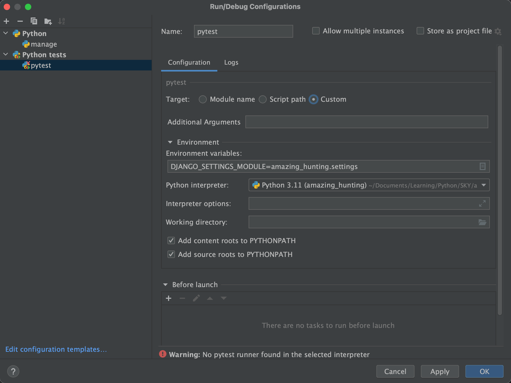

# Тестирование

### Django тестирование

```python
from Django.test import Client, TestCase
from Django.urls import revercse


class ItemTestCase(TestCase):
    # @classmethod
    # def setUpClass(cls):
    #     super().setUpClass()

    def setUp(self):
        self.client = Client()
        self.client.login(username='test_user', password='test_password')

    def tearDown(self):
        pass

    def test_item(self):
        response = self.client.get(reverse('item-list')
        self.assertEqual(response.status_code, 302)
        self.assertRedirects(response, reverse('login'))
        # self.assertTemplateUsed(response, 'app/item_list.html')
```

### DRF тестирование

```python
from Django.urls import revercse
from django_framework import status
from django_framework.test import APITestCase


class ItemTests(APITestCase):
    def setUp(self):
        self.user = User.objects.create(...)

    def test_create_tem(self):
        """Ensure we can create a new item object"""
        response = self.client.post(reverce('point'), {...}, format='json')
        self.assertEqual(response.status_code, status.HTTP_201_CREATED)
        self.assertEqual(Item.objects.count(), 1)
        self.assertIn('...', response.json())
        self.assertDictEqual(response.json(), {...})
```


## pytest

```shell
poetry add pytest-django
```

Для настройки необходимо указать в директиве `pytest` константу `DJANGO_SETTINGS_MODULE`:
```
# pytests.ini 

[pytest]  # poetry: [tool.pytest.ini_options]
DJANGO_SETTINGS_MODULE = project_name.settings
python_files = "test_*.py"
```



```python
# tests/simple_test.py
def test_root_not_found(client):
    response = client.get('/')
    assert response.status_code == 404
```

Запуск:
```shell
python -m pytest -rP
```


## Параметризация

декоратор, который используется когда eсть несколько тестов с одинаковым кодом, и которые отличаются только значением нескольких параметров.

```python
@pytest.mark.parametrize("test_input,expected", [("1+1", 2), ("1+2", 3)])
def test_eval(test_input, expected):
    assert eval(test_input) == expected
```


## Фикстура

– функция, которая выполняется до и после тестовых функций.

```python
# tests/fixtures.py
import pytest

@pytest.fixture
def token(db, client, django_user_model):
    username, password = 'test_user', 'test_password'

    # django_user_model - фикстура для создания пользователей
    django_user_model.objects.create_user(
        username=username, password=password, role='admin'
    )

    response = client.post(
        '/user/login/',
        {'username': username, 'password': password},
        format='json' 
    )
    return response.data['token']
```

Подключить фикстуру:
```python
# tests/conftests.py
pytest_plugins = 'tests.fixtures'
```

`@pytest.mark.django_db` - декоратор для сохранения записей в DB до теста, проверки сохранились ли они и очистки их после завершения теста.

```python
# tests/app_name/item_create_test.py
from datetime import date
import pytest

@pytest.mark.django_db
def test_create_item(client, token):
    data = {'text': 'text'}

    response = client.post(
        '/app_name/create/',
        data,
        content_type='application/json',  # format='json'
        HTTP_AUTHORIZATION='Token ' + token
    )
    
    expected_response = {
        'id': 1,
        'text': 'text',
        'created': date.today().strftime('%Y-%m-%d'),
        ...
        'user': None,
    }

    assert response.status_code == 201
    assert response.data == expected_response
```


## Фабрика

– класс, на основе которого будут генерироваться и предзаполняться данными модели в тестах.\
Фабрики также могут использоваться в качестве фикстур.

```shell
poetry add pytest-factoryboy
```

```python
# tests/factories.py
import factory

class UserFactory(factory.django.DjangoModelFactory):
    class Meta:
        model = User

    username = factory.Faker('name')
    first_name = factory.Faker('first_name')
    email = factory.Sequence(lambda n: f'user_{n}@example.com')
    password = 'test_password'

class ItemFactory(factory.django.DjangoModelFactory):
    class Meta:
        model = Item

    text = factory.Faker("sentence")
    user = factory.SubFactory(UserFactory)
    created = factory.Faker('date', end_datetime=datetime.date.today())  
    timestamp = factory.LazyFunction(datetime.now)
```

Подключить фабрику:
```python
# tests/conftests.py
from pytest_factoryboy import register
from tests.factories import UserFactory, ItemFactory

pytest_plugins = 'tests.fixtures'

register(UserFactory)
register(ItemFactory) 
```

Создадутся фикстуры по названию без 'Factory' и в нижнем регистре (строчными): user, item

```python
# tests/app_name/item_detail_test.py
from datetime import date
import pytest

@pytest.mark.django_db
def test_app_name_detail(client, item, token):
    response = client.get(
        f'/app_name/{item.pk}/',
        HTTP_AUTHORIZATION='Token ' + token
    )
    
    expected_response = {
        'id': vacancy.pk,
        'text': vacancy.text,
        'created': date.today().strftime('%Y-%m-%d'),
        ...
        'user': vacancy.user_id,
    }
    
    assert response.status_code == 200
    assert response.data == expected_response
```

### Использование фабрики для создание списка

```python
# tests/app_name/item_list_test.py
@pytest.mark.django_db
def test_vacancy_list(client):
    items = ItemFactory.create_batch(10)

    response = client.get('/app_name/')
    
    expected_response = {
        'count': 10,
        'next': None,
        'previous': None,
        'results': ItemListSerializer(items, many=True).data
    }

    assert response.status_code == 200
    assert response.data == expected_response
```
