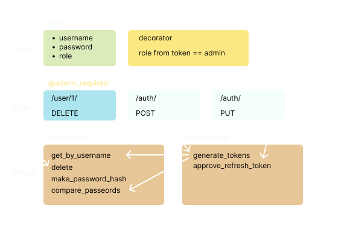

# [JWT](https://pyjwt.readthedocs.io/en/stable/)

– JSON Web Token – безопасный способ передачи информации между двумя участниками.\
Токен с временем истечения, состоит из 151 символа `___.___.___`.

`header.payload.signature`

* **Аутентификация** (authentication)
– процедура проверки подлинности, может происходить по:
    * Basic (login, password)
    * Token (Key)
    * OAuth 2.0 (протокол)
* **Идентификация**
– процедура выявления идентификатора (логин пароль);
* **Авторизация** (authorization)
– предоставление клиенту прав на выполнение определенных действий;

```
python -m pip install pyjwt
```

```python
from calendar import timegm
from datetime import datetime, timedelta
from Flask import Flask, request, abort
from flask_restx import Api, Resource
import jwt

app = Flask(__name__)
api = Api(app)
user_ns = api.namespace('')

secret = 's3cR$eT'  # не изменять!
algo = 'HS256'  # алгоритм


def generate_token(data: dict):  # в токене есть информация о пользователе
    min30 = datetime.utcnow() + timedelta(minutes=30)
    data['exp'] = timegm(min30.timetuple())  # так в библиотеке
    # data['exp'] = datetime.utcnow() + timedelta(minutes=30)  # так тоже можно
    token = jwt.encode(data, secret, algorithm=algo)
    return token


def check_token(token):
    try:
        jwt.decode(token, secret, algorithms=[algo])
        return True
    except jwt.exceptions.PyJWTError:
        return False


# декоратор
def auth_required(func):
    def wrapper(*args, **kwargs):
        if 'Authorization' not in request.headers:
            abort(401)  # Unauthorized

        data = request.headers['Authorization']
        token = data.split('Bearer ')[-1]
        if not check_token(token):
            abort(401)  # Unauthorized
        return func(*args, **kwargs)

    return wrapper


@user_ns.route('/users/')

:

@auth_required
def post(self):
    return '', 201


if __name__ == '__main__':
    data = {
        'username': 'myname',
        'role': 'user',
    }
    token = generate_token(data)
    is_ok = check_token(token)

    app.run(debug=True)
```

## refresh_token

access_token имеет непродолжительное время жизни,\
и чтобы не заставлять пользователя вводить свои данные повторно, токены обновляются с помощью одноразового refresh.


## Пароль

хранятся результаты работы **хеш функции** (например md5, SHA256, SHA512).

– функция, которая **необратимо** искажает исходную строку, пулучая на выходе **хеш**.

– искаженная строка, с псевдослучайными символами, построенная на базе другой.

**HMAC-SHA256** – hash-based message authentication code

**соль** – строка, которая добавляется перед поролем, чтобы хеш получился сложнее и его сложнее было подобрать.

**брутфорс** – грубый перебор паролей.


## Реализация

Пример аутентификации, без регистрации.



### модель

```python
# app/dao/model
from app.database import db

class User(db.Model):
    __tablename__ = 'user'
    
    id = db.Column(db.Integer, primary_key=True)
    username = db.Column(db.String)
    password = db.Column(db.String)
    role = db.Column(db.String)
```

### views

```python
# app/views/user
from app.decorators import admin_required 

@user_ns.route('/<int:user_id>')
class UserView(Resource)
    @admin_required    
    def delete(self, user_id):
        user_service.delete(user_id)
        return '', 204  # No Content
```

```python
# app/views/auth
from app.implemented import auth_service

@auth_ns.route('/')
class AuthsView(Resource)
    def post(self):
        data = request.json
        
        username = data.get('username')
        password = data.get('password')
        if None in [username, password]:
            abort(400)
            
        tokens = auth_service.generate_tokens(username, password)
        return jsonify(tokens), 201
        
    def put(self):
        data = request.json
        token = data.get('refresh_token')
        
        tokens = auth_service.approve_refresh_token(token)
        return jsonify(tokens), 201
```

### service

```python
# app/service/user
import base64
import hashlib
import hmac

from app.helpers.constants import PWD_HASH_TERATIONS, PWD_HASH_SALT  # 10_000, b'salt'
from app.dao.user import UserDAO

class UserService:
    def __init__(self, dao: UserDAO):
        self.dao = dao

    # ...
        
    def get_by_username(self, username):
        user = self.dao.get_by_username(username)
        return user

    def create(self, user_dict):
        user_dict['password'] = self.generate_password_hash(user_dict.get('password'))
        user_id = self.dao.create(req_json)
        return user_id
        
    def get_hash_digest(self, password):
        return hashlib.pbkdf2_hmac(
            'sha256',
            password.encode('utf-8'),
            PWD_HASH_SALT,
            PWD_HASH_ITERATIONS
        )  # бинарная последовательность чисел
        
    def make_password_hash(self, password):
        # hash_digest = hashlib.md5(password.encode('utf-8')).hexdigest()
        # return hash_digest.decode('utf-8', 'ignore')
        hash_digest = self.get_hash_digest(password)
        return base64.b64encode(hash_digest).decode('utf-8')
    
    def compare_passwords(self, password_hash, other_password) -> bool:
        return hmac.compare_digest(
            base64.b64decode(password_hash),
            self.get_hash_digest(other_password)
        )
```

```python
# app/services/auth
from calendar import timegm
from datetime import datetime, timedelta
import jwt
from Flask import abort
from constants import JWT_SECRET, JWT_ALGORITHM  # 'secret', 'HS256'
from app.service.user import UserService


class AuthService:
    def __init__(self, user_service: UserService):
        self.user_service = user_service

    def generate_tokens(self, username, password, is_refresh=False):
        user = self.user_service.get_by_username(username)

        if user is None:
            raise abort(404)

        if not is_refresh:
            if not self.user_service.compare_passwords(user.password, password):
                abort(400)

        data = {
            'username': user.username,
            'role': user.role,
        }

        min30 = datetime.utcnow() + timedelta(minutes=30)
        data['exp'] = timegm(min30.timetuple())
        access_token = jwt.encode(data, JWT_SECRET, algorithm=JWT_ALGORITHM)

        days30 = datetime.utcnow() + timedelta(days=30)
        data['exp'] = timegm(days30.timetuple())
        refresh_token = jwt.encode(data, JWT_SECRET, algorithm=JWT_ALGORITHM)

        return {
            'access_token': access_token,
            'refresh_token': refresh_token,
        }

    def approve_refresh_token(self, refresh_token):
        data = jwt.decode(jwt=refresh_token, key=JWT_SECRET, algorithms=[JWT_ALGORITHM])
        username = data.get('username')
        return self.generate_tokens(username, None, is_refresh=True)
```

### decorators

```python
# app/decorators
import jwt
from Flask import request, abort
from constants import JWT_SECRET, JWT_ALGORITHM  # 'secret', 'HS256'


def admin_required(func):
    def wrapper(*args, **kwargs):
        if 'Authorization' not in request.headers:
            abort(401)  # Unauthorized

        data = request.headers['Authorization']
        token = data.split('Bearer ')[-1]
        role = None

        try:
            jwt.decode(jwt=token, JWT_SECRET, algorithms=[JWT_ALGORITHM])
            role = user.get('role', 'user')
        except jwt.exceptions.PyJWTError:
            abort(401)  # Unauthorized

        if role != 'admin':
            abort(403)  # Forbidden

        return func(*args, **kwargs)

    return wrapper
```
