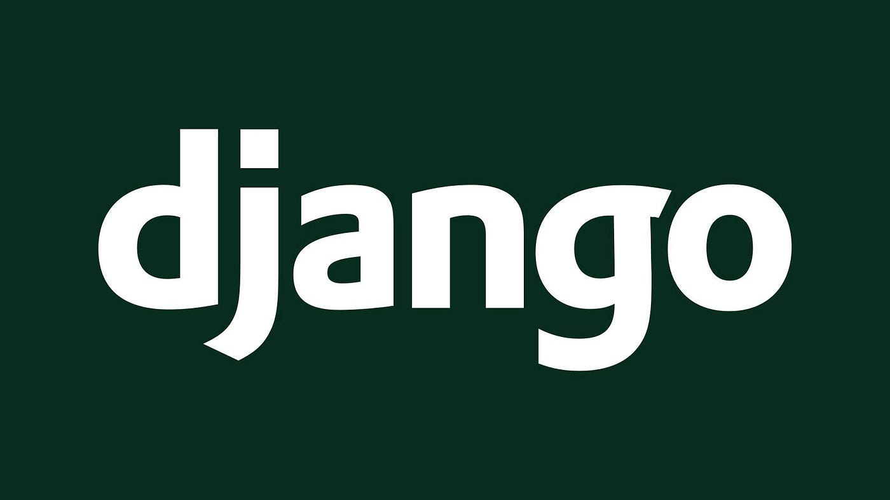
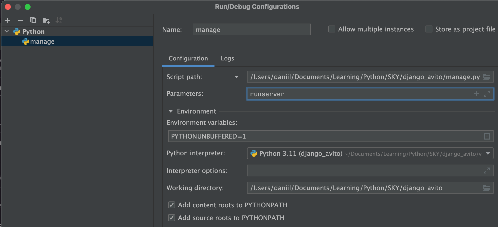
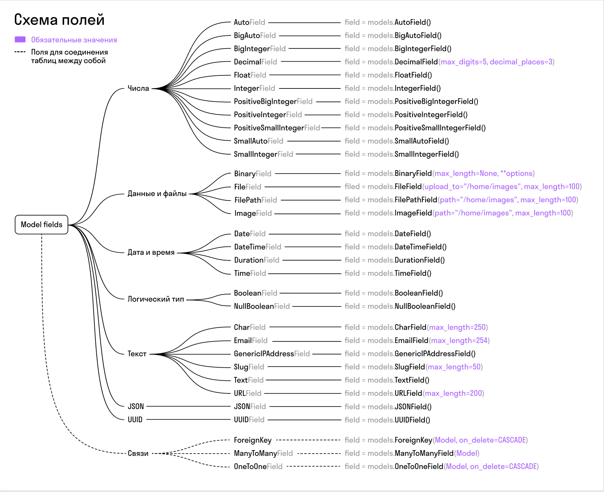

# [Django](https://www.djangoproject.com/)

\- Веб-фреймворк для создания сайтов.\
В отличии от микрофреймворка Flask, Django нуждается в меньшем количестве ручной настройки приложения и не нуждается в дополнительных пакетах для работы с ORM.



Django построен по принципу **MVC**, но именуется **MTV**:
* Model - отображение данных в ООП формат $\rightarrow$ **Model**
* View - визуальная составляющая $\rightarrow$ **Template**
* Controller - бизнес-логика приложения $\rightarrow$ **View**

Приложение разделено на app-ы, python-пакеты, оформленные специальным образом, являющиеся небольшими отдельными web-приложениями.\
Файл `manage.py` - консольная утилита, с помощью которой создаются папки и файлы, генерируется шаблонный код, накатываются миграции, запускается приложение.


## poetry

\- своременный пакетный менеджер, не такой "примитивный" как pip.

```bash
pip install poetry  :: установить
poetry init  :: создание pyproject.toml

poetry install  :: установить все зависимости
```

```bash
poetry add django  :: pip install django
```


### Виртуальное окружение `virtualenvwrapper`

```bash
python -m pip install virtualenvwrapper
:: python -m pip install virtualenv

python -V  :: узанть версию
which python  :: узнать расположение интерпертатора
export VIRTUALENVWRAPPER_PYTHON=/usr/bin/python3
export VIRTUALENVWRAPPER_VIRTUALENV=/usr/local/bin/virtualenv
source /usr/local/bin/virtualenvwrapper.sh
```

```bash
mkvirtualenv <name_project>

mkdir <name_project>
cd <name_project>
:: создать poetry

:: python -m venv env 
:: source ./env/bin/activate
deactivate
```


## Создать Django-приложение

```bash
django-admin startproject <name_project> .
./manage.py startapp <name_app>  :: создать отдельный функционал
./manage.py runserver  :: запустить сервер
```

подключение модуля приложения:
```python
# <name_project>/settings.py
INSTALLED_APPS = [
    ...
    '<name_app>',
]
```

Настройка интепретатора:



## Создать модель

Модель - это класс, который описывает поля (столбцы) таблицы DB.

```python
# name_app/models.py
from django.db import models

class M(models.Model):
    STATUS = [
        ('draft', 'Черновик'),
        ('open', 'Открыта'),
        ('closed', 'Закрыта')
    ]
    
    description = models.TextField(null=True, blank=True)
    slug = models.SlugField(max_length=50)
    text = models.CharField(max_length=100)
    status = models.CharField(max_length=6, choices=STATUS, default='draft')
    price = models.DecimalField(max_digits=15, decimal_places=2)
    image = models.ImageField(null=True, blank=True, upload_to='ad_images')
    time_create = models.DateTimeField(default=timezone.now)
    created = models.DateField(auto_now_add=True)  # datatime.date.now
    is_activated = models.BooleanField(default=False)
    
    def __str__(self):
        return self.slug
```



**Миграция** фиксирует текущее состояние DB.

```bash
./manage.py makemigrations
./manage.py migrate  :: накатить
./manage.py migrate <name_app> <num>  :: откатить

./manage.py loaddata ./data/file.json  :: загрузить данные
```


## Создать URL

соеденить адреса с views

```python
# name_project/urls.py
from django.contrib import admin
from django.urls import path, include
from name_app import views

urlpatterns = [
    path('admin/', admin.site.urls),
    path('items/', views.index),
    path('items/<int:item_id>', views.get),
    path('', include('app.urls'))  # подключить список
]
```

Допустимые параметры:
- `str` — любая непустая строка.
- `int` — 0 или любое положительное число.
- `slug` — строка из ASCII букв или чисел, а также дефисы и подчеркивание.
- `uuid` — универсальный уникальный идентификатор.
- `path` — непустая строка, включая /.


## Создать view

```python
# name_app/views.py
from django.http import HttpResponse, JsonResponse
from django.shortcuts import render
from name_app.models import M

def hello(request):
    return HttpResponse('Hello world')
```

### вытащить path-параметры

```python
def get(request, item_id):
    if request.method == 'GET':
        try:
            item = M.objects.get(pk=item_id)
        except Vacancy.DoesNotExist as exc:
            return JsonResponse({'error': str(exc)}, status=404)
        
        return JsonResponse({'id': item_id, 'field': item.field},
                                            json_dumps_params={"ensure_ascii": False})  # Кодировка
```


## GET запрос

```python
def index(request):
    if request.method == 'GET':
        items = M.objects.all()

        if search_field := request.GET.get('field'):  # принимает query-параметр
            items = items.filter(field=search_field)

        response = []
        for item in items:
            response.append({
                'id': item.id,
                'field': item.field,
            })

        return JsonResponse(response, safe=False,  # Передаем не словарь
                            json_dumps_params={"ensure_ascii": False})
```


## POST запрос

### CSRF

\- вектор атаки, межсайтовой подделки запросов, при котором вредоностный сайт делает запрос как-будто он уже авторизован.

В django отключить проверку csrf-токена можно через декторатор:
```python
from django.views.decorators.csrf import csrf_exempt

@csrf_exempt
def index(request):
    if request.method == 'GET':
        pass
    elif request.method == "POST":
        item_data = json.loads(request.body)

        # item = M()
        # item.text = item_data.get('text')
        # item.save()
        item = M.object.create(field=item_data.get('field'))
        
        return JsonResponse({'id': item_id, 'field': item.field},
                                            json_dumps_params={"ensure_ascii": False}) 
```


## class-based view

\- подход к написанию вьюшек через классы.

```python
from django.utils.decorators import method_decorator
from django.views import View
from django.views.decorators.csrf import csrf_exempt
from django.views.generic import DetailView
from ms.models import M

@method_decorator(csrf_exempt, name='dispatch')
class MView(View):
    def get(self, request):
        pass
    
    def post(self, request):
        pass


class MDetailView(DetailView):  # ListView для достуа к списку записей
    model = M
    
    def get(self, request, *args, **kwargs):
        # try:
        #     item = M.objects.get(pk=pk)
        # except M.DoesNotExist as exc:
        #     return JsonResponse({'error': str(exc)}, status=404)
        # item = self.get_object()  # self.object_list
        
        return JsonResponse({
            'id': item.id,
            'text': item.text,
        }, json_dumps_params={"ensure_ascii": False})
```

```python
urlpatterns = [
    ...
    # path('items/', views.index),
    path('items/', views.MView.as_view()),  # expect callable, который принимает первым аргументом request
    # path('items/<int:item_id>', views.get),
    path('vacancy/<int:pk>/', views.MDetailView.as_view()),  # pk or slug
]
```


## Панель Админки

\- UI над DB и позволяет гибко настраивать доступ

```python
# name_app/admin.py
from django.contrib import admin
from items.models import M

admin.site.register(M)
```

### создать супер пользователя

```bash
./manage.py createsuperuser
```
