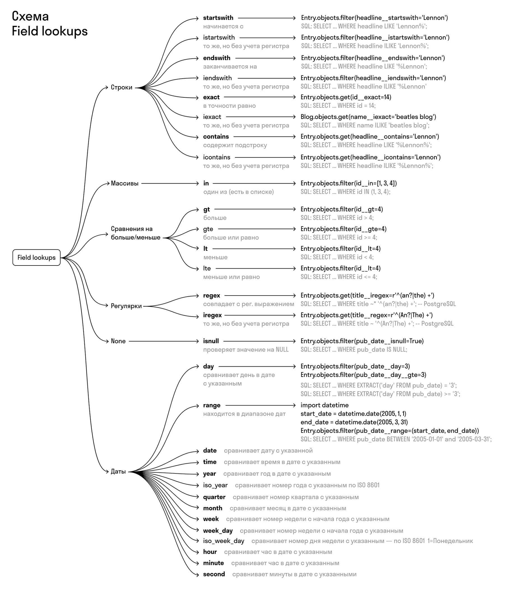

# [DRF](https://www.django-rest-framework.org/)

**Django REST Framework** - фреймворк поверх Django, с помощью которого можно очень удобно писать REST API.\
(Django задуман как монолитное приложение).


**GenericView** - класс, который используется для написания view какого-то конкретного URL.\
**Mixin** - класс-примесь, который используется для конкретной функциональности.\
**Serializer** - класс, который переводит python-объект в json-формат и наоборот.


## Установка DRF

```bash
poetry add djangorestframework
```

подключение в качестве модуля:
```python
# project_name/settings.py

INSTALLED_APPS = [
    ...
    'rest_framework',
    'app_name',
]
```

подключение url:
```python
# project_name/urls.py

urlpatterns = [
    path('api-auth/', include('rest_framework.urls')),
]
```


## Views

### Применение сериализаторов

```python
from app_name.serializer import MListSerializer, ...

class MListView(ListView):
    model = M
    
    def get(self, request, *args, **kwargs):
        super().get(request, *args, **kwargs)
        
        self.object_list = self.object_list.select_related('user').prefetch_related('skills').order_by('text')
        
        paginator = Paginator(self.object_list, settings.TOTAL_ON_PAGE)
        page_number = request.GET.get('page')
        page_obj = paginator.get_page(page_number)
        
        list(map(lambda x: setattr(x, 'username', x.user.username if x.user else None), page_obj))
        
        return JsonResponse({
            'items': MListSerializer(page_obj, many=True).data,
            'num_pages': paginator.num_pages,
            'total': paginator.count,
        }, safe=False)


class MDetailView(DetailView):
    model = M
    
    def get(self, request, *args, **kwargs):
        item = self.get_object()
        
        return JsonResponse(MDetailSerializer(vacancy).data)


@method_decorator(csrf_exempt, name='dispatch')
class MCreateView(CreateView):
    model = M
    fields = ('field', ...)
    
    def post(self, request, *args, **kwargs):
        item_data = VacancyCreateSerializer(data=json.loads(request.body))
        
        if vacancy_data.is_valid():
            vacancy_data.save()
        else:
            JsonResponse(vacancy_data.errors)
        
        return JsonResponse(vacancy_data.data, status=302)
```

### Применение DRF generic

```python
from rest_framework.generics import ListAPIView, ...
from app_name.serializer import MListSerializer, ...

class MListView(ListAPIView):
    queryset = M.objects.all()
    serializer_class = MListSerializer


class MDetailView(RetrieveAPIView):
    queryset = M.objects.all()
    serializer_class = MDetailSerializer
    # lookup_field = 'slug_field'


class MCreateView(CreateAPIView):
    queryset = M.objects.all()
    serializer_class = MCreateSerializer


class MUpdateView(UpdateAPIView):
    queryset = M.objects.all()
    serializer_class = MUpdateSerializer


class MDeleteView(DestroyAPIView):
    queryset = M.objects.all()
    serializer_class = MDestroySerializer
```

### Пагинация

```python
# project_name/urls.py

REST_FRAMEWORK = {
    'DEFAULT_PAGINATION_CLASS': 'rest_framework.pagination.PageNumberPagination',
    'PAGE_SIZE': 10,
}
```


## Serializer

```python
# app_name/serializer.py
from rest_framework import serializers

# данные не привязаны к модели
class MSerializer(serializers.Serializer):
    id = serializers.IntegerField()
    text = serializers.CharField(max_length=1000)

class MSerializer(serializers.ModelSerializer):
    class Meta:
        model = M
        fields = ('id', 'text')  # конкретные поля
        fields = '__all__'  # все поля из модели
        exclude = ('skills',)  # все поля, кроме
```


### SlugRelatedField

```python
class SkillsSerializer(serializers.ModelSerializer):
    class Meta:
        model = Skill
        fields = '__all__'


class MListSerializer(serializers.ModelSerializer):
    username = serializers.CharField(max_length=100)
    # skills = SkillsSerialiser(many=True)  # через связную модель для нескольких полей
    skills = serializers.SlugRelatedField(
        many=True,
        read_only=True,  # менять нельзя
        slug_field='name'  # по значению поля
    )

    class Meta:
        model = M
        fields = '__all__'
```

```python
class M(models.Model):
    ...
    user = models.ForeignKey(User, on_delete=models.CASCADE, null=True)  # создаст user_id
    skills = models.ManyToManyField(Skill)

    @property
    def username(self):
        return self.user.username if self.user else None
```

---

Create:
```python
class MCreateSerializer(serializers.ModelSerializer):
    id = serializers.IntegerField(required=False)  # при создании отсутствует
    skills = serializers.SlugRelatedField(
        required=False,
        many=True,
        queryset=Skill.objects.all(),
        slug_field='name'
    )

    class Meta:
        model = M
        fields = '__all__'

    def is_valid(self, *, raise_exception=False):
        self._skills = self.initial_data.pop('skills')
        return super().is_valid(raise_exception=raise_exception)

    def create(self, validated_data):
        item = M.objects.create(**validated_data)
        
        for skill in self._skills:
            skill_obj, _ = Skill.objects.get_or_create(name=skill)
            item.skills.add(skill_obj)
        item.save()
        return vacancy
```

Update:
```python
class MUpdateSerializer(serializers.ModelSerializer):
    skills = serializers.SlugRelatedField(
        required=False,
        many=True,
        queryset=Skill.objects.all(),
        slug_field='name'
    )
    user = serializers.PrimaryKeyRelatedField(read_only=True)
    created = serializers.DateField(read_only=True)

    class Meta:
        model = M
        fields = '__all__'

    def is_valid(self, *, raise_exception=False):
        self._skills = self.initial_data.pop('skills')
        return super().is_valid(raise_exception=raise_exception)

    def save(self, **kwargs):
        item = super().save(**kwargs)

        # for skill in item.skill.all():
        #     item.skill.remove(skill)
        for skill in self._skills:
            skill_obj, _ = Skill.objects.get_or_create(name=skill)
            item.skills.add(skill_obj)
        item.save()
        return item
```

Destroy:
```python
class MDestroySerializer(serializers.ModelSerializer):
    class Meta:
        model = M
        fields = ('id',)
```

## ViewSet

\- (ручки) базовыкласс, который содержит в себе все API-методы для одной модели. (от него наследуется APIView)

- ViewSet - базовый, без готовых action-методов
- GenericViewSet - есть некоторые готовые методы, но нет action
- ModelsViewSet - есть все базовые методы для работы с моделями
- ReadOnlyViewSet - только для чтения

```python
from rest_framework import viewsets

class UserViewSet(viewsets.ViewSet):
    def list(self, request):
		queryset = User.objects.all()
        serializer = UserSerializer(queryset, many=True)
        return Response(serializer.data)
    
    def retrieve(self, request, pk=None):
		queryset = User.objects.all()
        user = get_object_or_404(queryset, pk=pk)
        serializer = UserSerializer(user)
        return Response(serializer.data)
    
    def create(self, request):
        serializer = UserSerializer(data=request.data)
        serializer.is_valid(raise_exception=True)
        serializer.save(serializer)
        return Response(serializer.data, status=status.HTTP_201_CREATED)
    
    def update(self, request, pk=None):
		queryset = User.objects.all()
        user = get_object_or_404(queryset, pk=pk)
        
        serializer = UserSerializer(user, data=request.data, partial=partial)
        serializer.is_valid(raise_exception=True)
        serializer.save(serializer)
        return Response(serializer.data)
    
    def partial_update(self, request, pk=None):
        kwargs['partial'] = True
        return self.update(request, *args, **kwargs)
    
    def destroy(self, request, pk=None):
        queryset = User.objects.all()
        user = get_object_or_404(queryset, pk=pk)
        user.delete()
        return Response(status=status.HTTP_204_NO_CONTENT)
```

```python
class ItemViewSet(viewsets.GenericViewSet):
    serializer_class = ItemSerializer
    queryset = Item.objects.all()
    
    def list(self, request):
        serializer = self.get_serializer(self.get_queryset(), many=True)
        return self.get_paginated_response(self.paginate_queryset(serializer.data))
    
    def retrieve(self, request, pk):
        item = self.get_object()
        serializer = self.get_serializer(item)
        return Response(serializer.data)
    
    def create(self, request, *args, **kwargs):
        serializer = self.get_serializer(data=request.data)
        serializer.is_valid(raise_exception=True)
        serializer.save(serializer)
        return Response(serializer.data, status=status.HTTP_201_CREATED)
    
    def destroy(self, request):
        item = self.get_object()
        item.delete()
        return Response(status=status.HTTP_204_NO_CONTENT)
```

```python
class SkillsViewSet(ModelViewSet):
    queryset = Skill.objects.all()
    serializer_class = SkillSerializer
```

```python
class SkillSerializer(serializers.ModelSerializer):
    class Meta:
        model = Skill
        fields = '__all__'
```


### Router

\- класс, который распаковывает ViewSet в набор URL-машрутов.

```python
# project_name/urls.py
from rest_framework import routers

router = routers.SimpleRouter()
router.register('skill', views.SkillViewSet)

urlpatterns = [...]
urlpatterns += router.urls
```

## Поиск с помощью ORM

### Lookup field

\- ключевые слова в Django ORM для формирования WHERE-блока SQL-запроса



```python
    def get(self, request, *args, **kwargs):
        if item_text := request.GET.get('text'):
            self.queryset = self.queryset.filter(
                text__contains=item_text
            )
        return super().get(request, *args, **kwargs)
```


### Q-запросы

\- обертки для условий фильтрации, которые можно соеденить между собой с помощью логических операторов в WHERE-блоке SQL-запроса.

Lookup для связей:
```python
from django.db.models import Q

    def get(self, request, *args, **kwargs):
        # skills = request.GET.getlist('skill')
        # self.queryset = self.queryset.filter(
        #     skills__name__icontains=skills  # без учета регистра
        # )
        skills = request.GET.getlist('skill')
        skills_q = None
        for skill in skills:
            q = Q(skills__name__icontains=skill)
            skills_q = q if not skills_q else skills_q | q
        if skills_q:
            self.queryset = self.queryset.filter(skills_q)
        
        return super().get(request, *args, **kwargs)
```

### F-запросы

\- запросы с использованием класса F() для обращения к значению текущего столбца.

```python
from django.db.models import F

class ReporterUpdateView(UpdateAPIView):
    queryset = Reporter.objects.all()
    serializer_class = ReporterSerializer
    
    def patch(self, request, *args, **kwargs):
		reporter = Reporters.objects.get(name='Tintin')
		reporter.stories_filed = F('stories_filed') + 1
		reporter.save()
		
		# цепочка запросов
		# Vacancy.objects.filter(pk__in=request.data).update(likes=F('likes') + 1)
```
