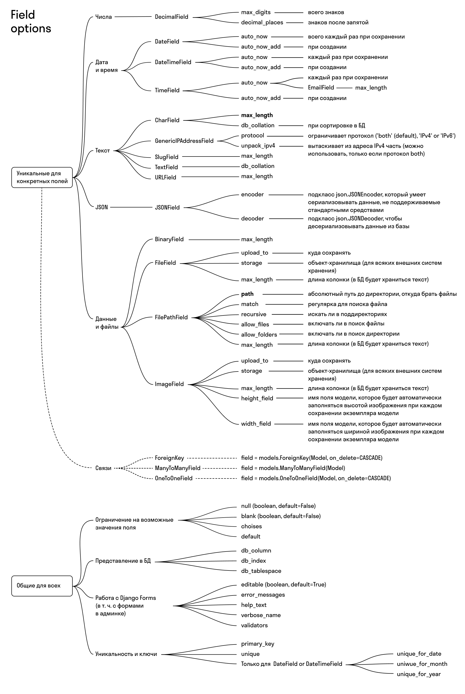

# Валидаторы

В Django встроены проверки данных на двух уровнях:
* при получении json объектов (указываются в *serializers*)
* при занесении данных в DB (указываются в *models*)

```python
# app_name/models.py
from django.core.exceptions import ValidationError
from django.core.validators import MinValueValidator

def check_date_not_past(value: date):
    if value < date.today():
        raise ValidationError(f'{value} is in the past.')

class Item(models.Model):
    min_experience = models.IntegerField(null=True, validators=[MinValueValidator(0)])
    updated_at = models.DateField(null=True, validators=[check_date_not_past])
```

[Подробнее](https://docs.djangoproject.com/en/4.1/ref/validators/#built-in-validators)

```python
# app_name/serializers.py
from rest_framework.validators import UniqueValidator

# используя класс, можно передавать параметры валидации
class NotInStatusValidator:
    def __init__(self, statuses):
        if not isinstance(statuses, list):
            statuses = [statuses]
        self.statuses = statuses

    def __call__(self, value):
        if value in self.statuses:
            raise serializers.ValidationError("Incorrect status")

class VacancyCreateSerializer(serializers.ModelSerializer):
    slug = serializers.SlugField(
        validators=[UniqueValidator(queryset=Vacancy.objects.all(), lookup='contains')]
    )
    status = serializers.CharField(validators=[max_length=8, NotInStatusValidator('closed')])
```

[Подробнее](https://www.django-rest-framework.org/api-guide/fields/#core-arguments)


### ограничения с помощью атрибутов поля:




## Логирование запросов в DB

```python
# project_name/settings.py

LOGGING = {
    'disable_existing_loggers': False,
    'version': 1,
    'handlers': {
        'console': {
            'class': 'logging.StreamHandler',
            'level': 'DEBUG',
        },
    },
    'loggers': {
        '': {
            'handlers': ['console'],
            'level': 'DEBUG',
            'propagate': False,
        },
        'django.db': {
            'level': 'DEBUG',
        },
    },
}
```
