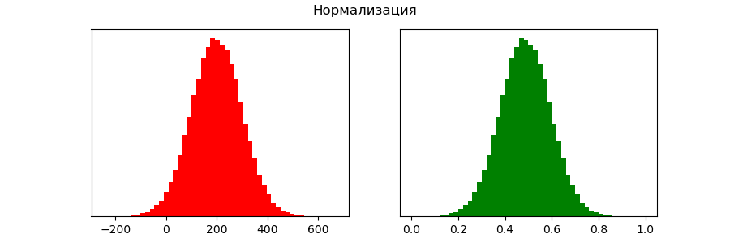
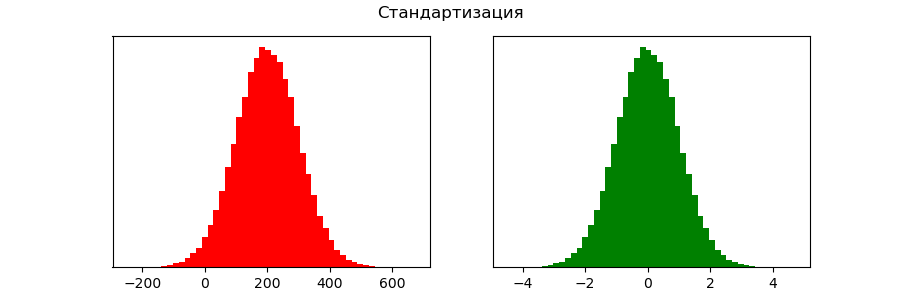
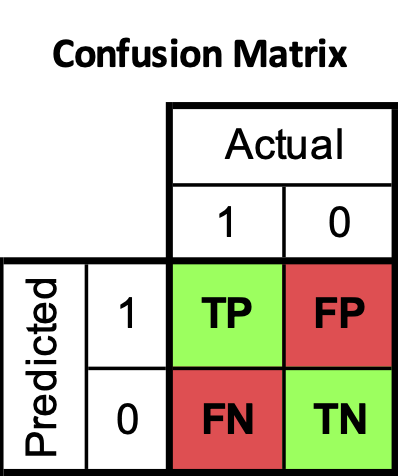
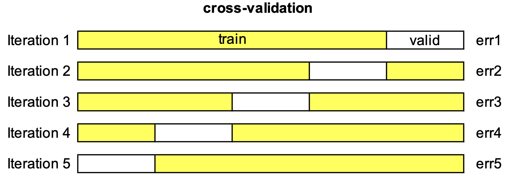
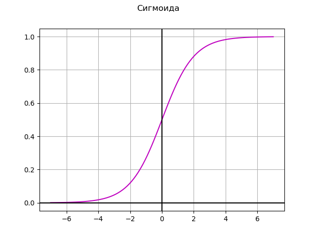

# Machine Learning

класс методов искусственного интеллекта, решающих задачу, строя алгоритм на основе размеченных данных
с целью уменьшения функции потерь.

**размеченные данные** - те, для которых есть правильные ответы, т.е. обучение с учителем

**кластеризация** - разделение данных на группы с похожими свойствами (обучение без учителя)

**типы данных:**

- **numeric (числовые)** выражаются на числовой шкале
  * **continuous (непрерывные)** могут принимать любое значение в интервале
  * **discrete (дискретные)** могут принимать только целочисленные значения
- **categorical (категориальные)** могут принимать только конкретное множество значений
  * **binary (двоичные)** данные с двумя категориями значений
  * **ordinal (порядковые)** имеют явно заданное упорядочение

**feature engineering** - извлекание новых признаков из необработанных данных

**выборки:**

- **train** - для обучения
- **valid** - для оптимизаций и подбора гиперпараметров
- **test** - для оценки качества модели

**переобучение** - эффект, при котором модель на тестовой выборке работает хуже, чем на обучающей

**sklearn** - библиотека с моделями, метриками и методами предобработки данных

```python
# предоставить Colab доступ к Google Drive
from google.colab import drive
drive.mount('/content/drive')
```

```python
# загружаем данные
import numpy as np
import pandas as pd
data = pd.read_csv('./drive/MyDrive/.../data.csv')
data.head()
```

**Leakage (утечка)** - использование в train информации из test 
и информации, которая не будет доступна во время применения модели

```python
data = data.drop(columns='leakage')
```

```python
# обработаем пропущенные значения
data['col'].fillna(data['col'].median(), inplace=True)
```

```python
# кодируем категориальные признаки
data.replace({'col': {'A': 0, 'B': 1}}, inplace=True)
data = pd.get_dummies(data, columns=categorical_columns)
```

```python
from sklearn.model_selection import train_test_split
X = data.drop(columns='target')
y = data['target']
X_train, X_valid, y_train, y_valid = train_test_split(X, y, test_size=0.25)
```


## Масштабирование признаков

### Нормализация



$$
x_i = \cfrac{x_i - x_{min}}{x_{max} - x_{min}} \ \Rightarrow \ x_{min} = 0, \ x_{max} = 1
$$

### Стандартизация



$$
x_i = \cfrac{x_i - \overline{x}}{\sigma_x} \ \Rightarrow \ \overline{x} = 0, \ \sigma_x = 1
$$

стандартное отклонение: $\sigma_x = \sqrt{variance} = \sqrt{\cfrac{\sum\limits_{i=1}^{n}(x_i - \overline{x})^2}{n - 1}}$

```python
# масштабируем признаки
from sklearn.preprocessing import StandardScaler # mean=0, s=1 / MinMaxScaler [0, 1]
scaler = StandardScaler()
scaler.fit(X_train[numerical_cols])
X_train[numerical_cols] = scaler.transform(X_train[numerical_cols])
X_valid[numerical_cols] = scaler.transform(X_valid[numerical_cols])
```


## KNN (K-Nearest Neighbor / k-ближайших соседей)

[Идея:](https://scikit-learn.org/stable/modules/generated/sklearn.neighbors.KNeighborsClassifier.html)
алгоритм определяет k ближайших соседей каждого объекта и присваивает ему класс, 
который наиболее часто встречается среди этих соседей, или среднее значение.

свойства:
- интерпретируемый (возможно посмотреть k соседей и увидеть что модель усредняла),
- необходимость задавать метрику расстояния,
- подвержена проклятию размерности - чем больше признаков, тем меньше плотность объектов и медленнее работает,
- склонен к переобучению,
- может обрабатывать нелинейные зависимости

```python
# обучаем модель
from sklearn.neighbors import KNeighborsClassifier
model_knn = KNeighborsClassifier(n_neighbors=5)
model_knn.fit(X_train, y_train)
y_pred = model_knn.predict(X_valid)
```


## Метрики

численный показатель качества модели (интерпретируемый)

```python
# смотрим на метрики
from sklearn.metrics import accuracy_score, precision_score, recall_score, f1_score
print(f'Accuracy={accuracy_score(y_valid, y_pred)}')
```



**Accuracy** $= \cfrac{TP + TN}{TP + TN + FP + FN}$ - доля верных ответов

**Precision** $= \cfrac{TP}{TP + FP}$ - точность

**Recall** $= \cfrac{TP}{TP + FN}$ - полнота

**F1 score** $= \cfrac{2 \cdot Precision \cdot Recall}{Precision + Recall}$ - средневзвешенное


## Функция потерь

для обучения, должна быть удобной для минимизации

```python
from sklearn.metrics import mean_squared_error, mean_absolute_error, mean_absolute_percentage_error, r2_score
print(f'MSE={mean_squared_error(y_valid, y_pred)}')
```

**MAE** $= \cfrac{1}{n} \sum\limits_{i=1}^{n}|y_i - \hat{y}_i|$ - mean absolute error

**MAPE** $= \cfrac{1}{n} \sum\limits_{i=1}^{n}\left|\cfrac{y_i - \hat{y}_i}{\hat{y}_i}\right|$ - mean absolute percentage error

**MSE** $= \cfrac{1}{n} \sum\limits_{i=1}^{n}(y_i - \hat{y}_i)^2$ - mean squared error

$\text{R}^2 = 1 - \cfrac{\sum(y_i - \hat{y}_i)^2}{\sum(y_i - \overline{y})^2}$ - коэффициент детерминации (доля объясненной дисперсии)


## k-fold, cross-validation

позволяет использовать все данные для обучения



```python
from sklearn.metrics import mean_squared_error, make_scorer
from sklearn.neighbors import KNeighborsRegressor
knn = KNeighborsRegressor(5)

#----------------------------------------------------------------
from sklearn.model_selection import KFold

cv = KFold(n_splits=5)
errors = []
for train_idx, valid_idx in cv.split(X):
    X_train, X_valid, y_train, y_valid = X[train_idx], X[valid_idx], y[train_idx], y[valid_idx]
    knn.fit(X_train, y_train)
    
    y_pred = knn.predict(X_valid)
    errors.append(mean_squared_error(y_valid, y_pred))
#----------------------------------------------------------------
from sklearn.model_selection import cross_val_score

scorer = make_scorer(lambda y_true, y_pred: mean_squared_error(y_true, y_pred), 
                     greater_is_better=False) # ошибка будет с минусом
errors = -cross_val_score(knn, X, y, cv=5, scoring=scorer)
#----------------------------------------------------------------

print('RMSE=', np.mean(errors) ** 0.5) # в масштабе признаков
```


## Поиск по сетке

позволяет подобрать гиперпараметры

```python
knn = KNeighborsRegressor()

param_grid = {
    'n_neighbors': np.arange(1, 11),
    'metric': ['manhattan', 'euclidean'],
    'weights': ['uniform', 'distance'],
}

from sklearn.model_selection import GridSearchCV
search = GridSearchCV(knn, param_grid, cv=5, scoring='accuracy',
                      n_jobs=-1) # максимальное количество параллельных вычислений
search.fit(X, y)

print(search.best_params_)
y_pred = search.best_estimator_.predict(X)
```


## Linear Regression (линейная регрессия)

[Идея:](https://scikit-learn.org/stable/modules/generated/sklearn.linear_model.LinearRegression.html)
алгоритм прогнозирует значения числовой непрерывной целевой переменной как взвешенную cумму признаков.

свойства:
- интерпретируемый (использует линейную функцию для предсказания)
- плохо работает, если зависимость имеет нелинейный характер

**матричное решение**: $X \omega = y \ \ \Rightarrow \ \ \omega = X^{-1} y \approx (X^T X)^{-1} X^T y$

### Градиентный спуск

нахождения локального минимума дифференцируемой функции

$L(\omega) = MSE = \cfrac{1}{n} \sum\limits_{i=1}^n(\langle \omega, x_i \rangle - y_i)^2 \rightarrow min$

$\nabla_w L = \text{basicTerm} = \cfrac{2}{n} \cdot X^T (X \omega - y)$

шаг градиентного спуска: $\omega = \omega - \alpha \cdot \nabla_w L$

### Регуляризация

для борьбы с мультиколлинеарностью можно добавить регуляризационное слагаемое, 
которое будет штрафовать за большие коэффициенты

$L(\omega) = MSE + C \cdot R(\omega) \rightarrow min$

$\nabla_w L = \text{basicTerm} + \text{regularizationTerm}$

#### $L_1$ Регуляризация (Lasso-регрессия)

$R(\omega) = \sum\limits_{i=1}^n |\omega_i|$

$\text{regularizationTerm} = (0, sign(\omega_1), ..., sign(\omega_n))^T$

#### $L_2$ Регуляризация (Ridge-регрессия)

$R(\omega) = \sum\limits_{i=1}^n \omega_i^2$

$\text{regularizationTerm} = (0, 2\omega_1, ..., 2\omega_n)^T$

```python
def soft_sign(x, eps=1e-7):
    if abs(x) > eps:
        return np.sign(x)
    return x / eps
np_soft_sign = np.vectorize(soft_sign)


class MyLinearRegression:
        
    def __init__(self, C=1):
        self.coef_ = None  # (w1, w2, w3, ...)
        self.intercept_ = None  # w0
        self.C = C  # коэффициент регуляризации
        
    def fit(self, X, y, max_iter=100, lr=0.1):
        X = np.array(X)
        y = np.array(y)
        
        n = len(X)
        
        # добавляем вектор-столбец из единиц для смещения w0
        x0 = np.ones((n, 1))
        X = np.hstack((x0, X))
        
        #----------------------------------------------------------------
        # матричное решение
        weights = np.linalg.inv(X.T @ X) @ X.T @ y
        #----------------------------------------------------------------
        # градиентный спуск
        rng = np.random.default_rng(42)
        weights = rng.normal(size=X.shape[1]) # инициализируем веса
        
        losses = []
        
        for iter_num in range(1, max_iter=100):
            basic_term = 1. / n * (X.T @ (X @ weights - y))
            #----------------------------------------------------------------
            # L1 регуляризация (Lasso)
            regularization_term = np_soft_sign(weights)
            regularization_term[0] = 0 
            #----------------------------------------------------------------
            # L2 регуляризация Ridge)
            regularization_term = 2 * weights
            regularization_term[0] = 0
            #----------------------------------------------------------------
            grad = basic_term + self.C * regularization_term
               
            weights -= grad * lr / (iter_num ** 0.5)

            # calculate loss
            loss = np.mean((X @ weights - y) ** 2) + self.C * np.sum(np.abs(weights[1:]))
            losses.append(loss)
        #----------------------------------------------------------------
        
        self.coef_ = weights[1:]
        self.intercept_ = weights[0]
        return losses
        
    def predict(self, X):
        X = np.array(X)
        y_pred = X @ self.coef_ + self.intercept_ 
        return y_pred
```

```python
# обучаем модель
from sklearn.linear_model import LinearRegression, Lasso, Ridge
model_lr = LinearRegression()
model_lr.fit(X_train, y_train)

print(model_lr.coef_, model_lr.intercept_)
y_pred = model_lr.predict(X_valid)
```

### Стохастический градиентный спуск
Проблема градиентного спуска в том, что на больших выборках считать на каждом шаге градиент по всем имеющимся данным 
может быть вычислительно сложно. В стохастическом варианте градиентного спуска поправки для весов вычисляются 
только с учетом одного случайно взятого объекта обучающей выборки.


## Логистическая Regression (Логистическая регрессия)

[Идея:](https://scikit-learn.org/stable/modules/generated/sklearn.linear_model.LogisticRegression.html)
линейный алгоритм вычисляет вероятности принадлежности объектов к двум классам подбирая веса 
для оптимизации логистической функции потерь

$a(x) = sign(\langle x, \omega \rangle)$

свойства:
- плохо работает, если зависимость имеет нелинейный характер
- чувствителен к мультиколлинеарности признаков

$loglos = -\cfrac{1}{n} \sum\limits_{i=1}^n (y_i \cdot \ln(\hat{y}_i) + (1 - y_i) \cdot \ln(1 - \hat{y}_i))$

$P(y=1) = \sigma(\langle x, \omega \rangle) = \cfrac{1}{1 + e^{-\langle x, \omega \rangle}}$



$\sigma'(x)=\sigma(x) \cdot (1 - \sigma(x))$

$ПP(y_i) \Rightarrow \ln(П P(y_i)) = \sum \ln(P(y_i)) \rightarrow max$

$L(\omega) = -\sum\limits_{i=1}^n \ln(\cfrac{1}{1 + e^{-\langle x, \omega \rangle}}) = \cfrac{1}{n} \sum\limits_{i=1}^n \ln(1 + e^{-y_i \cdot \langle x_i, \omega \rangle}) \rightarrow min$

задача минимизации эмпирического риска, в отличии от минимизации функции потерь, ошибка считается на всей обучающей выборке как доля неправильно классифицированных объектов

$\nabla_w L = \text{basicTerm} = -\cfrac{1}{n} \sum\limits_{i=1}^n y^i \cdot \left( 1 - \sigma( y^i \cdot \langle x^i, \omega \rangle ) \right) \cdot x^i$

```python
class MyLogisticRegression(object):

    def __init__(self, C=1):
        self.coef_ = None
        self.intercept_ = None
        self.C = C

    def sigmoid(self, t):
        return 1. / (1 + np.exp(-t))

    def fit(self, X, y, max_iter=100, lr=0.1):
        X = np.array(X)
        y = np.array(y)
        y = 2 * y - 1
        
        n = len(X)

        # добавляем вектор-столбец из единиц для смещения w0
        x0 = np.ones((n, 1))
        X = np.hstack((x0, X))
        
        # инициализируем веса
        rng = np.random.default_rng(42)
        weights = rng.normal(size=X.shape[1])
                
        losses = []
        
        for iter_num in range(1, max_iter):
            logits = (X @ weights.reshape(X.shape[1], 1)).ravel()
            
            coef = y * (1 - self.sigmoid(y * logits))
            grads = -X * coef.reshape(-1, 1)
            basic_term = grads.mean(axis=0)
    
            regularization_term = 2 * weights
            regularization_term[0] = 0

            grad = basic_term + self.C * regularization_term
 
            weights -= grad * lr / (iter_num ** 0.5)

            loss = np.mean(np.log(1 + np.exp(-y * logits))) + self.C * np.sum(weights[1:] ** 2)
            losses.append(loss)
        
        self.coef_ = weights[1:]
        self.intercept_ = weights[0]
        return losses

    def predict_proba(self, X):
        X = np.array(X)
        
        x0 = np.ones((n, 1))
        X = np.hstack((x0, X))
        
        weights = np.concatenate([self.intercept_.reshape([1]), self.coef_])
        logits = (X @ weights.reshape(-1, 1))
        return self.sigmoid(logits)

    def predict(self, X, threshold=0.5):
        return self.predict_proba(X) >= threshold
```

```python
# обучаем модель
from sklearn.linear_model import LogisticRegression
model_clf = LogisticRegression(C=1) # чем меньше, тем сильнее регуляризация
model_clf.fit(X_train, y_train)

print(model_clf.coef_, model_clf.intercept_)
y_pred = model_clf.predict_proba(X_valid)
```

### ROC-AUC

площадь под ROC-кривой (receiver operating characteristic - area under the curve)

устойчив к несбалансированным классам,
график строится через сортировку вероятностей предсказаний на осях TPR и FPR

$TPR = \frac{TP}{TP + FN}$

$FPR = \frac{FP}{FP + TN}$

$\text{ROC-AUC} = \frac{TPR \cdot FPR}{2} + TPR \cdot (1 - FPR) + \frac{(1-TPR) \cdot (1-FPR)}{2} = \frac{1 + TPR - FPR}{2}$

```python
from sklearn.metrics import roc_auc_score
roc_auc_score(y_pred, y_test)
```
