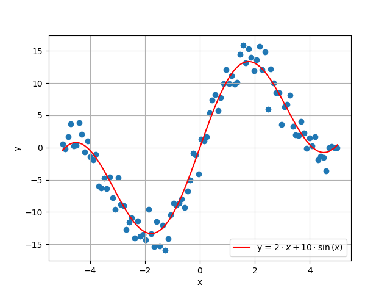
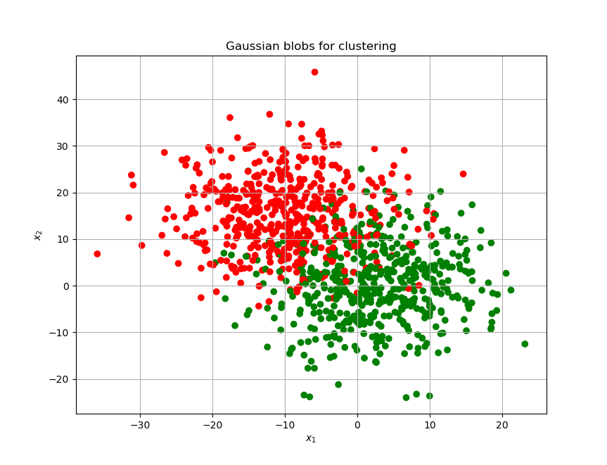

# Pypelines

\- конвеер преобразований


## Генерация датасетов

```Python
import numpy as np
import pandas as pd

def target_function(x):
    return 2 * x + 10 * np.sin(x)
    
def generate_samples():
    """Generate noisy samples.
    """
    np.random.seed(42)
    x = np.linspace(-5, 5, 100)
    y = target_function(x) + np.random.normal(scale=2, size=100)
    return x.reshape(-1, 1), y
    
X, y = generate_samples()
```



[datasets](https://scikit-learn.org/stable/datasets.html)

```Python
from sklearn.datasets import make_blobs
X, y = make_blobs(n_samples=1000, centers=[[-10, 15],[2,-0.5]], cluster_std=8, random_state=42)

import matplotlib.pyplot as plt
colors = ('red', 'green')
colored_y = np.zeros(y.size, dtype=str)

for i, cl in enumerate([0,1]):
	colored_y[y == cl] = str(colors[i])

plt.figure(figsize=(15,10))
plt.scatter(X[:, 0], X[:, 1], c=colored_y)
plt.xlabel('$x_1$')
plt.ylabel('$x_2$')
plt.grid(True)
plt.title('Gaussian blobs for clustering')
plt.show()
```




## Автоматическая подготовка данных

```python
df.dtypes  # посмотреть типы столбцов
df['G1'] = df['G1'].astype(int)

import seaborn as sns
plt.subplots(figsize=(12, 10))
sns.heatmap(df.corr(),fmt='.2f', square = True, annot=True)
plt.show()  # посмотреть матрицу корреляций

from sklearn.model_selection import train_test_split
X_train, X_test, y_train, y_test = train_test_split(df.drop(columns = ['G1']), df['G1'], test_size=0.2, random_state=42)

categorical_features = df.select_dtypes(include= object).columns.values  # список названий категориальных столбцов
numeric_features = df.select_dtypes(exclude= object).columns.values

# конвейер подготовки данных числового типа
from sklearn.pipeline import make_pipeline
from sklearn.impute import SimpleImputer
from sklearn.preprocessing import StandardScaler
numeric_transformer = make_pipeline(
	SimpleImputer(strategy="median"),  # пропуски заполняются медианными значениями
	StandardScaler()  # для решающий деревьев нет необходимости, так как они создают ортогональные поверхности при разделении
)

from sklearn.compose import ColumnTransformer
from sklearn.preprocessing import OneHotEncoder
preprocessor = ColumnTransformer(
    [
        (
        	'num',  # название этапа
        	numeric_transformer,  # метод
        	numeric_features  # название колонок 
        ),
        (
            'cat',
            OneHotEncoder(handle_unknown='ignore', sparse=False),
            categorical_features
        )
    ],
    verbose_feature_names_out = False,  # не выводить отладочную информацию 
)

# подготовка и обучение алгоритма
from sklearn.pipeline import Pipeline
from sklearn.ensemble import RandomForestRegressor
alg = Pipeline(steps=[
    ('enc', preprocessor), # подготовка
    ('alg', RandomForestRegressor()) # алгоритм
])


# обучение алгоритма
alg.fit(X_train, y_train)

preds = alg.predict(X_test)
from sklearn.metrics import r2_score, median_absolute_error
r2_score(y_test, preds)  # коэффициент детерминации
median_absolute_error(y_test, preds)
```


## Grid search

**Гиперпараметры** - параметры модели, то есть изначальные настройки, изменения которых влияют на метрики качества.

```python
parameters = {
    # название этпапа подготовки__гиперпараметр: [сетка (список) параметров]
    'alg__n_estimators': [100, 300, 500, 1000],
    'alg__min_samples_leaf': [1, 2, 4, 6],
    'alg__max_features': ['auto', 'sqrt', 'log2']
}

from sklearn.model_selection import GridSearchCV
gs = GridSearchCV(alg, parameters, cv=5, verbose=2, n_jobs=2)

gs.fit(X_train, y_train)
print(gs.best_params_)

gs.cv_results_  # все результаты во время обучения

preds = gs.best_estimator_.predict(X_test)

r2_score(y_test, preds), median_absolute_error(y_test, preds)
```
