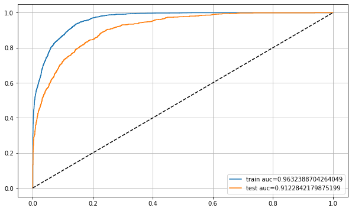
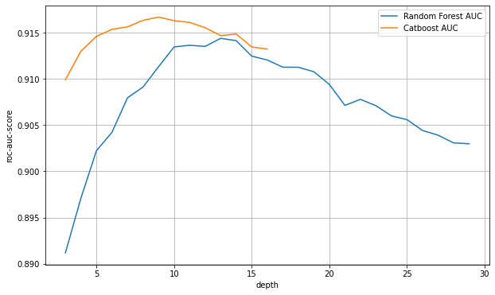

# Случайный лес

* KNN\
**+** прост в понимании\
**-** не обладает достаточной обобщающей способностью (не стабилен к выбросам, склонен к переобучению)\
**-** требует много времени для применения (запоминает всю обучающую выборку)

* линейные алгоритмы\
**+** стабилен к выбросам\
**-** не имеет большого количества степеней свободы, чтобы восстанавливать закономерности произвольной сложности

* решающие деревья\
**+** обладает значительной вариативностью\
**-** склонен к переобучению\
**-** требовательный к размеру обучающей выборки

$\Downarrow$

### Bagging (bootstrap aggregation)

\- построение композиции алгоритмов (Ensemble), основанный на множестве независимых моделей и их усреднении.

$\Downarrow$

## Random Forest

[Идея:](https://scikit-learn.org/stable/modules/generated/sklearn.ensemble.RandomForestClassifier.html)
бэггинг на решающих деревьях.

```python
import numpy as np
import pandas as pd

data = pd.read_csv('data_train.csv')
data.replace('?', np.nan, inplace=True)  # Заменить в таблице все знаки '?' на np.nan
data.isna().sum()  # проверить пропущенные значения

data.replace({'>50K,<=50K': {'<=50K': 0, '>50K': 1}}, inplace=True)
data['>50K,<=50K'] = data['>50K,<=50K'].eq('>50K')  # или так

y = data.pop('>50K,<=50K')  # X = data
y = y.astype(np.int32)

real_data = data[real_columns]
cat_data = data[cat_columns]

from sklearn.preprocessing import OneHotEncoder
ohe = OneHotEncoder(handle_unknown='ignore', sparse=False)
one_hot_data = ohe.fit_transform(data[cat_columns])
one_hot_data = pd.DataFrame(one_hot_data, index=cat_data.index)

from sklearn.model_selection import train_test_split
train_real_data, test_real_data, \
train_one_hot_data, test_one_hot_data, \
y_train, y_test = train_test_split(real_data, one_hot_data, 
                                   y, train_size=0.7)

train_data_for_forest = pd.concat([train_real_data, train_one_hot_data], axis='columns')
test_data_for_forest = pd.concat([test_real_data, test_one_hot_data], axis='columns')

from sklearn.ensemble import RandomForestClassifier
from sklearn.model_selection import cross_val_score
#  Используя кросс-валидацию ищется оптимальная глубина дерева
depths = np.arange(3, 20)
rf_metrics = []
for depth in depths:
    scores = cross_val_score(RandomForestClassifier(max_depth=depth),
                             train_data_for_forest, y_train, cv=5, scoring='roc_auc', n_jobs=-1)
    rf_metrics.append(np.mean(scores))

best_depth = 3 + rf_metrics.index(max(rf_metrics))
model = RandomForestClassifier(n_estimators=100, max_depth=best_depth)
model.fit(train_data_for_forest, y_train)
test_y_pred_forest = model.predict_proba(test_data_for_forest)[:, 1]

from sklearn.metrics import roc_curve, roc_auc_score
test_auc = roc_auc_score(y_test, test_y_pred_forest)
```

Построим ROC-кривые для получившейся модели.
```python
plt.figure(figsize=(10,6))
plt.plot(*roc_curve(y_train, train_y_pred_forest)[:2], 
         label=f'train auc={train_auc}')
plt.plot(*roc_curve(y_test, test_y_pred_forest)[:2], 
         label=f'test auc={test_auc}')


plt.plot([0,1], [0,1], '--', color='black')
plt.legend()
plt.grid()
```



**мета-алгоритм** - вместо усреднения, обучать новый алгоритм.

**Стекинг** - построение композиций из небольшого количества сильных базовых алгоритмов\
в задаче регрессии берется среднее, а в задаче классификации — голосование по большинству.

**блендинг** - выделение данных для мета-алгоритма.

**бустинг** - последовательное построение алгоритмов, где каждый следующий алгоритм компенсирует предыдущий.

**Градиентный бустинг** - использует градиентный спуск для минимизации ошибки каждой новой модели.

**XGBoost, GBM, CatBoost, H2O**

```python
!pip install catboost  # установка библиотеки в colab

from sklearn.model_selection import train_test_split
train_data, test_data, \
train_real_data, test_real_data, \
train_cat_data, test_cat_data, \
y_train, y_test = train_test_split(data, real_data, cat_data, 
                                   y, train_size=0.7)

from catboost import CatBoostClassifier, Pool, cv
train_cat_data = train_cat_data.fillna('unknown')
test_cat_data = test_cat_data.fillna('unknown')

train_data_for_boosting = pd.concat([train_real_data, train_cat_data], axis='columns')
test_data_for_boosting = pd.concat([test_real_data, test_cat_data], axis='columns')

cat_features = np.arange(train_cat_data.shape[1]) + train_real_data.shape[1]  # номера столбцов категориальных фич
train_dataset = Pool(data=train_data_for_boosting, 
                     label=y_train, 
                     cat_features=cat_features)
test_dataset = Pool(data=test_data_for_boosting, 
                     label=y_test, 
                     cat_features=cat_features)

#  Используя кросс-валидацию ищется оптимальная глубина дерева
depths = np.arange(3, 17)
boosting_metrics = []
for depth in depths:
    params = {"iterations": 100,
              "depth": depth,
              "loss_function": "Logloss",
              "custom_loss": "AUC",
              "verbose": False}
    scores = cv(pool=train_dataset, params=params, fold_count=5)
    boosting_metrics.append(scores.iloc[-1, 5])  # последняя строчка столбца 'test-AUC-mean'

best_depth = 3 + boosting_metrics.index(max(boosting_metrics))
model = CatBoostClassifier(iterations=500, depth=best_depth, loss_function='Logloss', verbose=False)
model.fit(train_dataset)
test_y_pred_boosting = model.predict_proba(test_dataset)[:, 1]
test_auc = roc_auc_score(y_test, test_y_pred_boosting)
# scoring_dataset = Pool(data=scoring_data_for_boosting, cat_features=cat_features)
# scoring_y_pred_boosting = model.predict_proba(scoring_dataset)[:,1]
```

Сравним модели случайный лес и catboost по метрике ROC-AUC.
```python
plt.figure(figsize=(10,6))
plt.plot(np.arange(3, 30), rf_metrics, label='Random Forest AUC')
plt.plot(np.arange(3, 17), boosting_metrics, label='Catboost AUC')
plt.xlabel('depth')
plt.ylabel('roc-auc-score')
plt.grid()
plt.legend()
```


