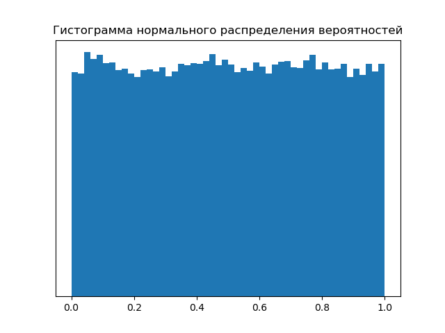
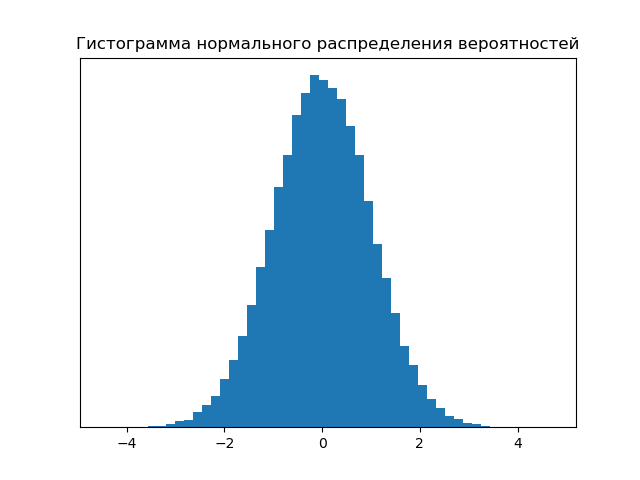

# NumPy

Библиотека для быстрой работы с числовыми массивами, работы со статистикой и c линейной алгеброй.

```Python
import numpy as np
```


## Создать массив

```Python
a = np.array([1,2,3], dtype='float32')
```
```Markdown
> a = [1., 2., 3.]
```

&nbsp;
```Python
a = np.array([[1, 2, 3], [4, 5, 6]])
```
```Markdown
> a = [[1, 2, 3],
       [4, 5, 6]]
```

```Python
print('измерений: ', a.ndim) # 2
print('размерность: ', a.shape) # (2, 3)
print('количество элементов: ', a.size) # 6
print('тип элементов: ', a.dtype) # int64
```

```Python
print(a[1, 2]) # 6
print(a[:, 2]) # [3, 6]
print(a[1, [0, 2]]) # [4, 6]
print(a > 4]) # [5, 6]
```

```Python
a = a.reshape((3, 2))
```
```Markdown
> a = [[1, 2],
       [3, 4],
       [5, 6]]
```

```Python
a = a.flatten()
```
```Markdown
> a = [1, 2, 3, 4, 5, 6]
```

&nbsp;
```Python
a = np.arange(7)
```
```Markdown
> a = [0, 1, 2, 3, 4, 5, 6]
```

&nbsp;
```Python
a = np.linspace(0, 100, 5)
```
```Markdown
> a = [  0.,  25.,  50.,  75., 100.]
```

&nbsp;
```Python
a = np.full(2, np.pi)
```
```Markdown
> a = [3.14159265, 3.14159265]
```

&nbsp;
```Python
a = np.zeros(7)
```
```Markdown
> a = [0., 0., 0., 0., 0., 0., 0.]
```

&nbsp;
```Python
a = np.ones((2, 2), dtype='int32')
```
```Markdown
> a = [[1, 1]
       [1, 1]]
```

&nbsp;
```Python
# np.identity(3)
np.eye(3)
```
```Markdown
> a = [[1., 0., 0.],
       [0., 1., 0.],
       [0., 0., 1.]]
```


## Создать массив из случайных чисел

```Python
import random

random.random() # случайное число [0.0, 1.0)
random.randint(0, 9) # случайное целое число [0, 9]
random.randrange(0, 10, 2) # случайное число из [0, 2, 4, 6, 8]

words = ['A', 'B', 'C', 'D', 'E']
random.choice(words)

random.seed(1) # seed для воспроизводимости, по умолчанию системное время
a = np.array([random.random() for _ in range(5)])
```
```Markdown
> a = [0.13436424, 0.84743374, 0.76377462, 0.25506903, 0.49543509]
```

&nbsp;
```Python
# np.random.rand(2, 4) # равномерное распределение
rng = np.random.default_rng(0) # создание экземпляра Generator
a = rng.random(size=(2, 4))
```
```Markdown
> a = [[0.63696169, 0.26978671, 0.04097352, 0.01652764],
       [0.81327024, 0.91275558, 0.60663578, 0.72949656]]
```



&nbsp;
```Python
# np.random.randn(2, 4) # нормальное распределение
rng = np.random.default_rng(0)
a = rng.normal(size=(2, 4))
```
```Markdown
> a = [[ 0.12573022, -0.13210486,  0.64042265,  0.10490012],
       [-0.53566937,  0.36159505,  1.30400005,  0.94708096]]
```



&nbsp;
```Python
rng = np.random.default_rng(0)
a = rng.uniform(1, 3, size=(2, 4))
```
```Markdown
> a = [[2.27392337, 1.53957343, 1.08194705, 1.03305527],
       [2.62654048, 2.82551115, 2.21327155, 2.45899312]]
```

&nbsp;
```Python
#np.random.randint(3, 7, size=(2, 4))
rng = np.random.default_rng(0)
a = rng.integers(3, 7, size=(2, 4))
```
```Markdown
> a = [[6, 5, 5, 4],
       [4, 3, 3, 3]]
```


## Действия с массивами

операции '+', '-', '\*', '/' и т. д. работают поэлементно

```Python
a = np.array ([[1,2,3], [4, 5, 6]])
b = np.array ([[1,1,1], [4, 4, 4]])
c = np.array ([1,3,2])
d = np.array ([[2],[5]])
```
```Markdown
> a = [[1, 2, 3],  b = [[1, 1, 1],  c = [1, 3, 2]   d = [[2],
       [4, 5, 6]]       [4, 4, 4]]                       [5]]
```

```Python
e = a + 2
f = a - b
g = a * c
h = a % d
```
```Markdown
> e = [[3, 4, 5],  f = [[0, 1, 2],  g = [[ 1,  6,  6],  h = [[1, 0, 1],
       [6, 7, 8]]       [0, 1, 2]]       [ 4, 15, 12]]       [4, 0, 1]]
```

```Python
k = np.all(e > f)
l = np.any(e == f)
```
```Markdown
> k = True   l = False
```

редактирование массивов

```Python
a = np.arange(1, 7).reshape((2, 3))
b = np.where((a < 2) | (a > 5), -1, a) # a[(a < 2) | (a > 5)] = -1
```
```Markdown
> a = [[1, 2, 3],  b = [[-1,  2,  3],
       [4, 5, 6]]       [ 4,  5, -1]]
```

слияние массивов

```Python
a = np.arange(1, 7).reshape((2, 3))
b = np.arange(7, 13).reshape((2, 3))
c = np.arange(1, 3).reshape((2, 1))
```
```Markdown
> a = [[1, 2, 3],  b = [[ 7,  8,  9],  c = [[1],
       [4, 5, 6]]       [10, 11, 12]]       [2]]
```

```Python
d = np.vstack([a, b]) # np.concatenate([a, b], axis=0)
e = np.hstack([a, b]) # np.concatenate([a, b], axis=1)
f = np.column_stack([a, c])
```
```Markdown
> d = [[ 1,  2,  3],  e = [[ 1,  2,  3,  7,  8,  9],  f = [[1, 2, 3, 1],
       [ 4,  5,  6],       [ 4,  5,  6, 10, 11, 12]]       [4, 5, 6, 2]]
       [ 7,  8,  9],
       [10, 11, 12]]
```

диагональ

```Python
a = np.arange(1, 10).reshape((3, 3))
b = a.diagonal()
c = np.diag(b)
```
```Markdown
> a = [[1, 2, 3],  b = [1, 5, 9]   c = [[1, 0, 0],
       [4, 5, 6],                       [0, 5, 0],
       [7, 8, 9]]                       [0, 0, 9]]
```

массив накопительных сумм

```Python
a = np.arange(1, 9).reshape((2, 4))
b = np.cumsum(a, axis=0)
c = np.cumsum(a, axis=1)
```
```Markdown
> a = [[1, 2, 3, 4],  b = [[ 1,  2,  3,  4],  c = [[ 1,  3,  6, 10],
       [5, 6, 7, 8]]       [ 6,  8, 10, 12]]       [ 5, 11, 18, 26]]
```


## Линейная алгебра

$l1\ норма\ \text{(манхэттенское расстояние)}:\ \left\Vert \vec x \right\Vert_{1} = \sum\limits_{i=1}^{n} \left| x_{i} \right|$

```Python
x = np.array([1, 2, -2])
l1 = np.linalg.norm(a, ord=1)
```
```Markdown
> x = [1, 2, -2]   l1 = 5.
```

$l2\ норма\ \text{(евклидово расстояние)}:\ \left\Vert \vec x \right\Vert_{2} = \left| \vec x \right| = \sqrt{\sum\limits_{i=1}^{n} x_{i}^2}$

```Python
x = np.array([1, 2, -2])
l2 = np.linalg.norm(a) # ord=2
```
```Markdown
> x = [1, 2, -2]   l2 = 3.
```

скалярное произведение векторов

$$
<\vec{a}, \vec{b}> = \sum\limits_{i=1}^{n} a_i b_i = \left| a \right| \left| b \right| \cos(\varphi)
$$

$<\vec{a}, \vec{a}> = \left| \vec a \right|^2 = \sum\limits_{i=1}^{n} a_i^2$ \
$<\lambda \vec{a}, \vec{b}> = \lambda <\vec{a}, \vec{b}>$ \
$<\vec{a} + \vec{b}, \vec{c}> = <\vec{a}, \vec{c}> + <\vec{b}, \vec{c}>$

```Python
a = np.array([1, 2, 3])
b = np.array([4, 1, 0])
product = np.dot(a, b) # a.dot(b)
```
```Markdown
> a = [1, 2, 3]   b = [4, 1, 0]   product = 6
```

произведение матриц

$$
A_{n \times k} \cdot B_{k \times m} = C_{n \times m},\ где\ с_{ij} = \sum\limits_{r=1}^{k} a_{ir} b_{rj}
$$


$(AB)C = A(BC)$ \
$(A + B)C = AC + BC$ \
$AE = EA = A$

```Python
a = np.array([[1, 0, 2], [2, 3, 1]])
b = np.array([[4, 1, 0, 2], [2, 1, 3, 4], [1, 4, 2, 0]])
product = a @ b # np.dot(a, b)
```
```Markdown
> a = [[1, 0, 2],  b = [[4, 1, 0, 2],  product =  [[ 6,  9,  4,  2],
       [2, 3, 1]]       [2, 1, 3, 4],              [15,  9, 11, 16]]
                        [1, 4, 2, 0]]
```

транспонированная матрица

$$
A^T,\ где\ a_{ij}^T = a_{ji}
$$

$(AB)^T = B^T A^T$

```Python
a = np.arange(1, 9).reshape((2, 4))
t = np.transpose(a) # a.T
```
```Markdown
> a = [[1, 2, 3, 4],  t = [[1, 5],
       [5, 6, 7, 8]]       [2, 6],
                           [3, 7],
                           [4, 8]]
```

Ранг матрицы - максимальное число линейно независимых строк (столбцов)

```Python
a = np.arange(1, 9).reshape((2, 4))
r = np.linalg.matrix_rank(a)
r
```
```Markdown
> a = [[1, 2, 3, 4],  r = 2
       [5, 6, 7, 8]]
```

минимальное значение выражения ${\left\Vert X \omega - y \right\Vert}_2^2$ достигается на векторе: $\omega = X^{-1} y \approx (X^T X)^{-1} X^T y$

обратная матрица существует только у квадратной невырожденной (определитель не равен нулю) матрицы

$A^{-1} A = A A^{-1} = E$

```Python
a = np.array([[1, 3], [2, 1]])
i = np.linalg.inv(a)
```
```Markdown
> a = [[1, 3],  i = [[-0.2,  0.6]
       [2, 1]]       [ 0.4, -0.2]]
```

$$
A^{-1} = \frac{1}{\det(A)}A_{+}^{T}
$$

$a_{ij+} = (-1)^{i+j} M_{ij}$

определитель матрицы

$$
\det(A) = |A| = \sum\limits_{j=1}^{n} a_{ij } a_{ij+} = \sum\limits_{j=1}^{n} (-1)^{i+j} a_{ij} M_{ij}
$$

$\det(A) = \det(A^T)$

```Python
a = np.array([[1, 3], [2, 1]])
d = np.linalg.det(a)
```
```Markdown
> a = [[1, 3],  d = -5
       [2, 1]]
```

> Для квалратной матрицы: если ранг == n $\Rightarrow$ dim $\neq$ 0 $\Rightarrow$ существует обратная матрица.

решения СЛУ

$$
X \omega = y \ \ \Rightarrow \ \ \omega = X^{-1} y
$$

```Python
x = np.array([[4, -2, 3],[1, 3, -4],[3, 1, 2]])
y = np.array([[1],[-7],[5]])

w = np.linalg.solve(x, y)
w = np.linalg.inv(x) @ y
w = np.linalg.inv(x.T @ x) @ x.T @ y
w = w.astype('int32')
```
```Markdown
> x = [[4, -2,  3],  y = [[ 1],  w = [[-1],
       [1,  3, -4],       [-7],       [ 2],
       [3,  1,  2]])      [ 5]]       [ 3]]
```       
