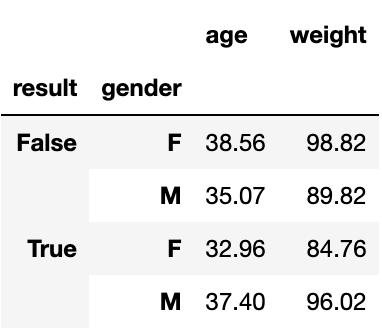

# Pandas

библиотека для анализа данных и удобного представления их в виде таблиц

```Python
import pandas as pd
```

## Series 

одномерный индексированный массив данных фиксированного типа

```Python
data = pd.Series(['December', 'January', 'February'], index=['Dec', 'Jan', 'Feb'], name='Winter')
```
```Markdown
> Dec    December
  Jan     January
  Feb    February
  Name: Winter, dtype: object
```

&nbsp;
```Python
# .loc принимает метки из индекса
data.loc[['Dec', 'Feb']] # data[['Dec', 'Feb']]
```
```Markdown
> Dec    December
  Feb    February
  dtype: object
```

&nbsp;
```Python
# .iloc принимает порядковые номера
data.iloc[[0, 2]] # data[[0, 2]]
```
```Markdown
> Dec    December
  Feb    February
  dtype: object
```


## DataFrame

двухмерная структура данных, представляющая собой таблицу

```Python
df = pd.DataFrame({'month': data, 'col1': np.arange(3), 'col2': [9, 8, 7]}, index=['Dec', 'Jan', 'Feb'])

df = pd.DataFrame([['December', 0 , 9], ['January', 1 , 8], ['February', 2 , 7]],
                  columns=['month', 'col1', 'col2'], index=['Dec', 'Jan', 'Feb'])
```
||**month**|**col1**|**col2**|
|:-:|:-:|:-:|:-:|
|**Dec**|December|0|9|
|**Jan**|January|1|8|
|**Feb**|February|2|7|

&nbsp;
```Python
df.loc['Dec'] # .loc принимает метки из индекса
```
```Markdown
> month    December
  col1            0
  col2            9
  Name: Dec, dtype: object
```

&nbsp;
```Python
df.loc['Dec', 'col1']
```
```Markdown
> 0
```

&nbsp;
```Python
df.loc['Dec':'Feb', ['col1', 'col2']]
```
||**col1**|**col2**|
|:-:|:-:|:-:|
|**Dec**|0|9|
|**Jan**|1|8|
|**Feb**|2|7|

&nbsp;
```Python
df.iloc[0] # .iloc принимает порядковые номера
```
```Markdown
> month    December
  col1            0
  col2            9
  Name: Dec, dtype: object
```

&nbsp;
```Python
df.iloc[0, 1]
```
```Markdown
> 0
```

&nbsp;
```Python
df.iloc[0:2, [1, 2]]
```
||**col1**|**col2**|
|:-:|:-:|:-:|
|**Dec**|0|9|
|**Jan**|1|8|

&nbsp;
```Python
df[['col1', 'col2']]
```
||**col1**|**col2**|
|:-:|:-:|:-:|
|**Dec**|0|9|
|**Jan**|1|8|
|**Feb**|2|7|

&nbsp;
```Python
df[(df['col1'] < 2) & (df['col2'] > 8)] # или: '|'
```
||**month**|**col1**|**col2**|
|:-:|:-:|:-:|:-:|
|**Dec**|December|0|9|


## добавление и удаление

```Python
new_df = pd.DataFrame({'month': ['March', 'April'], 'col1': ['3', '4'], 'col2': ['6', '5']})
df = pd.concat([df, new_df], ignore_index=True) # axis=0, keys=['winter', 'spring']
df.index += 1
```
||**month**|**col1**|**col2**|
|:-:|:-:|:-:|:-:|
|**1**|December|0|9|
|**2**|January|1|8|
|**3**|February|2|7|
|**4**|March|3|6|
|**5**|April|4|5|

&nbsp;
```Python
df['col3'] = np.full(5, False)
df.insert(1, 'col0', np.arange(5)*2)
```
||**month**|**col0**|**col1**|**col2**|**col3**|
|:-:|:-:|:-:|:-:|:-:|:-:|
|**1**|December|0|0|9|False|
|**2**|January|2|1|8|False|
|**3**|February|4|2|7|False|
|**4**|March|6|3|6|False|
|**5**|April|8|4|5|False|

&nbsp;
```Python
df.drop(4, axis=0, inplace=True) # ('col0', axis=1) или (columns='col0')
```
||**month**|**col0**|**col1**|**col2**|**col3**|
|:-:|:-:|:-:|:-:|:-:|:-:|
|**1**|December|0|0|9|False|
|**2**|January|2|1|8|False|
|**3**|February|4|2|7|False|
|**5**|April|8|4|5|False|


## первичное исследование

```Python
df = pd.read_csv('./data/data.csv', index_col=0) # sep=','
# df.to_csv('./data/data.csv') # index=False
# df = pd.read_excel('./data/data.xlsx').fillna('').to_dict(orient='records')

df.head() # 5
```
||**name**|**gender**|**age**|**weight**|**result**|
|:-:|:-:|:-:|:-:|:-:|:-:|
|**1**|Jamie|M|43|111.60|False|
|**2**|Sam|M|56|141.78|True|
|**3**|Sam|M|16|43.02|False|
|**4**|Avery|male|39|101.30|True|
|**5**|Jordan|F|20|51.12|True|

&nbsp;
```Python
df.columns
```
```Markdown
> Index(['name', 'gender', 'age', 'weight', 'result'], dtype='object')
```

&nbsp;
```Python
df.shape
```
```Markdown
> (100, 5)
```

&nbsp;
```Python
df.dtypes
```
```Markdown
> name       object
  gender     object
  age         int64
  weight    float64
  result       bool
  dtype: object
```

&nbsp;
```Python
df.isna().sum()
```
```Markdown
> name      11
  gender     0
  age        0
  weight     0
  result     0
  dtype: int64
```

&nbsp;
```Python
df['name'].fillna('-', inplace=True)
```

```Python
df.info()
```
```Markdown
> <class 'pandas.core.frame.DataFrame'>
  Int64Index: 100 entries, 1 to 100
  Data columns (total 5 columns):
   #   Column  Non-Null Count  Dtype  
  ---  ------  --------------  -----  
   0   name    100 non-null    object 
   1   gender  100 non-null    object 
   2   age     100 non-null    int64  
   3   weight  100 non-null    float64
   4   result  100 non-null    bool   
  dtypes: bool(1), float64(1), int64(1), object(2)
  memory usage: 4.0+ KB
```

&nbsp;
```Python
df.gender.unique()
```
```Markdown
> array(['M', 'male', 'F', 'female'], dtype=object)
```

&nbsp;
```Python
d = {'male': 'M', 'female': 'F'}
df.replace({'gender': d}, inplace=True)
```

```Python
df.gender.value_counts()
```
```Markdown
> M    54
  F    46
  Name: gender, dtype: int64
```


## исследование

```Python
print(df['age'].mean(), 2), round(df['age'].std())
```
```Markdown
> 35.69 13.57
```

&nbsp;
```Python
round(df.describe(), 2)
```
||**age**|**weight**|
|:-:|:-:|:-:|
|**count**|100.00|100.00|
|**mean**|35.69|91.57|
|**std**|13.57|34.25|
|**min**|12.00|30.18|
|**25%**|23.00|58.48|
|**50%**|38.00|96.72|
|**75%**|46.00|117.18|
|**max**|59.00|149.18|

&nbsp;
```Python
df[['age', 'weight']].apply(['mean', 'std'])
```
||**age**|**weight**|
|:-:|:-:|:-:|
|**mean**|35.69|91.57|
|**std**|13.57|34.25|

Map и apply возвращают серию, в которой все значения преобразованы функцией.
Функция которая передается в map ожидает один элемент, а в apply - строку.

```Python
df.apply(lambda row: row.age>30, axis='columns')
df.age.map(lambda age: age>30)
```

&nbsp;
```Python
# df.sort_index()
df.sort_values(['gender', 'age'], ascending=[False, True]).head(5)
```
||**name**|**gender**|**age**|**weight**|**result**|
|:-:|:-:|:-:|:-:|:-:|:-:|
|**81**|Sam|M|12|30.18|False|
|**8**|Alex|M|13|34.69|False|
|**78**|Jesse|M|13|36.13|True|
|**97**|Jamie|M|13|34.32|True|
|**65**|Taylor|M|13|37.71|True|

&nbsp;
```Python
pd.crosstab(df['result'], df['gender'], normalize=True, margins=True)
```


&nbsp;
```Python
df.pivot_table(index='result', columns='gender', aggfunc='mean')
```


&nbsp;
```Python
columns_to_show = ['age', 'weight']
df.groupby(by=['result', 'gender'])[columns_to_show].mean() # .agg([np.mean, np.std])
```

