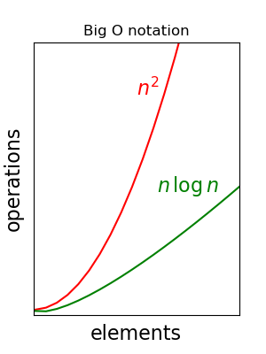

# Aлгоритмы сортировок

Aлгоритмы сортировок можно разделить на две группы: последовательные и параллельные. Последовательные алгоритмы простые и понятные, но имеют квадратичную сложность $O(n^2)$ в среднем, а параллельные (рекурсивные) -  $O(n \log{n})$, но требуют затратов на пямять.

`Нотация "O-большое" служит для сравнения эффектинсти алгоритмов и показывает влияние размера данных на производительность.`




## Сортировка пузырьком

**Идея** - последовательно слева направо сравнивать значения соседних элементов, менять местами, если они не в правильном порядке. После каждой итерации самый большой элемент будет "всплывать" в конец массива.

```Python
def bubble_sort(array):
    def swap(i, j):
        array[i], array[j] = array[j], array[i]
        
    length = len(array)
    while(length != 1):
        max_index = 1
        for i in range(1, length):
            if array[i - 1] > array[i]:
                swap(i - 1, i)
                max_index = i
        length = max_index

```


**Шейкерная сортировка cocktail_sort** отличается от пузырьковой тем, что она двунаправленная: перемещается слева направо, затем справа налево.

**Гребневая сортировка comb_sort** отличается от пузырьковой тем, что она сравнивает не соседние элемнеты, а элементы через сокращающийся промежуток.


## Сортировка выбором

**Идея** - на каждой итерации искать самый маленький элемент и ставить его к началу массива.

```Python
def selection_sort(array):
    def swap(i, j):
        array[i], array[j] = array[j], array[i]

    length = len(array)
    for i in range(length - 1):
        min_index = i
        for j in range(i + 1, length):
            if array[j] < array[min_index]:
                min_index = j
        if min_index != i:
            swap(min_index, i)

```


## Сортировка вставками

**Идея** - на каждой итерации один элемент перемещается в направлении к началу массива, где постепенно собирается отсортированный подмассив.

```Python
def insertion_sort(array):
    def swap(i, j):
        array[i], array[j] = array[j], array[i]

    length = len(array)
    for i in range(1, length):
        n_sorted = i - 1
        while n_sorted > -1 and array[n_sorted] > array[n_sorted + 1]:
            swap(n_sorted, n_sorted + 1)
            n_sorted -= 1

```


**Количество сравнений в массиве при n = 100**
||bubble sort|selection sort|insertion sort|
|:----|:---:|:---:|:---:|
|случайный|4950|4950|2549|
|инверсированный|4950|4950|4950|


## Сортировка слиянием

**Идея** - рекурсивно разбивать массивы на подмассивы и "сливать" в правильном пордке.

```Python
def merge(left, right):
    array = []
    while len(left) and len(right):
        if left[0] < right[0]:
            array.append(left[0])
            left = left[1:]
        else:
            array.append(right[0])
            right = right[1:]
    array.extend(left)
    array.extend(right)
    return array
    
def merge_sort(array):
    length = len(array)
    if length > 1:
        middle = length // 2
        left = merge_sort(array[:middle])
        right = merge_sort(array[middle:])
        return merge(left, right)
    return array

```


## Быстрая сортировка

**Идея** - выбирать опорный элемент, переместить элементы меньше опорного влево от него и большие - вправо и рекурсивно повторять так с левым и правым подмассивами.

```Python
def quick_sort(array):
    length = len(array)
    
    if length <= 1:
        return array

    pivot_index = length // 2
    pivot = array[pivot_index]
    less = []
    greater = []
    
    for i in range(length):
        if i == pivot_index:
            continue
        if array[i] < pivot:
            less.append(array[i])
        else:
            greater.append(array[i])
    
    return [*quick_sort(less), pivot, *quick_sort(greater)]

```

`Сортировка слиянием требует меньшего количества сравнений чем быстрая сортировка, но быстрая сортировка требует затратов на память O(log(n)), когда сортировка слиянием - O(n).`


## Сортировка в Python

```Python
array = [3, 2, 4, 1, 5, 0, 6]
# array.sort() - изменит список на месте
array = sorted(array) # принимает любой итерируемый обьект
print(array)
```
> [0, 1, 2, 3, 4, 5, 6]

```Python
array = [3, 2, 4, 1, 5, 0, 6]
print(sorted(array, reverse=True)) # сортировка по убыванию
```
> [6, 5, 4, 3, 2, 1, 0]

```Python
print(sorted("A B C a b c".split(), key=str.lower)) # key принимает функцию, которая применяется к каждому элементу
print(sorted({1: 'E', 2: 'D', 3: 'C', 4: 'B', 5: 'A'}.items(), key=lambda x: x[1]))
```
> ['A', 'a', 'B', 'b', 'C', 'c'] \
> [(5, 'A'), (4, 'B'), (3, 'C'), (2, 'D'), (1, 'E')]

```Python
from operator import itemgetter

student_tuples = [
    ('Alex', 'A', 15),
    ('Dave', 'B', 12),
    ('John', 'C', 11),
    ('Kate', 'A', 10),
    ('Matt', 'A', 12),
    ('Nick', 'B', 14),
]

print(sorted(student_tuples, key=itemgetter(1, 2))) # key=lambda x: (x[1], x[2])
```
> [('Kate', 'A', 10), ('Matt', 'A', 12), ('Alex', 'A', 15), ('Dave', 'B', 12), ('Nick', 'B', 14), ('John', 'C', 11)]

```Python
from operator import attrgetter

class Student:
    def __init__(self, name, grade, age):
        self.name = name
        self.grade = grade
        self.age = age
    def __repr__(self):
        return repr((self.name, self.grade, self.age))

student_objects = [
    Student('Alex', 'A', 15),
    Student('Dave', 'B', 12),
    Student('John', 'C', 11),
    Student('Kate', 'A', 10),
    Student('Matt', 'A', 12),
    Student('Nick', 'B', 14),
]

print(sorted(student_objects, key=attrgetter('grade', 'age')))
```
> [('Kate', 'A', 10), ('Matt', 'A', 12), ('Alex', 'A', 15), ('Dave', 'B', 12), ('Nick', 'B', 14), ('John', 'C', 11)]
