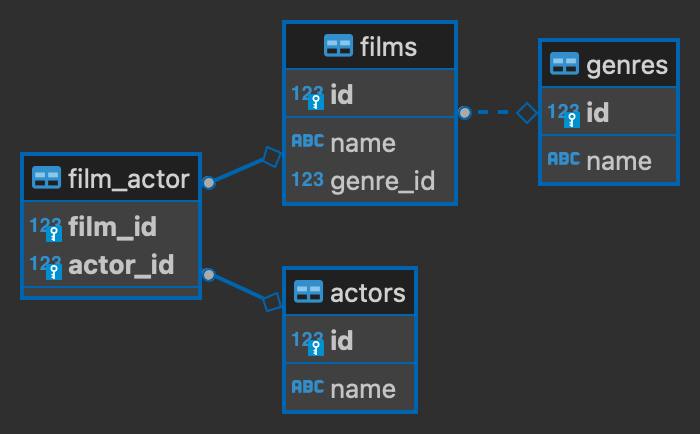

# SQL

**Structured Query Language** – язык запросов, предназначенный для создания, обработки и хранения баз данных (DB), представляет собой простую линейную последовательность операторов.

* [вопросы для собеседовании](https://tproger.ru/articles/sql-interview-questions/)
* [графический дизайн DB](https://app.dbdesigner.net/designer)
* [MySQL](https://proglib.io/p/mysql-queries)
* [группы операций](https://sky.pro/media/gruppy-operatorov-sql/)


## База данных (DB)

\- упорядоченная структура хранения иформации преимущественно больших объемов.

- **реляционные** (от слова "отношение") данные хранятся в виде связных таблиц
- **нереляционные** данные хранятся иначе, например в виде хэш-таблиц, дерева, графов и т. д.


### DBMS (СУБД)

**DataBase Management System (Система Управления Базы Данных)** – ПО, которое обрабатывает SQL-запросы на получение, изменение и удаление информации из DB.

**DB** $\Leftrightarrow$ **СУБД** $\Leftrightarrow$ **SQL-запросы**

- **реляционные**
    - MySQL – используется web-разработчиками для создания диномических сайтов;
	- MariaDB – форк от MySQL более производительный и с улучшенной безопасностью;
    - Oracle – коммерческая СУБД, используется в бизнесе и для банковских операций;
    - PostgreSQL – алтернатива Oracle, с открытым исходным кодом, с полной поддержкой стандарта SQL;
- **нереляционные**
    - MongoDB – для хранения документов JSON;
    - Cassandra – СУБД для распределенной DB на нескольких сереверах;
    - Redis – для обработки DB в оперативной памяти;

**pgAdmin** – это инструмент для администрирования базы данных PostgreSQL на уровне сервера.\
**DBeaver** – это универсальный инструмент для работы с разными СУБД на уровне пользователя.

### сравнение SQLite и PostgreSQL

* SQLite
    - легковесная
    - мало поддерживаемых типов данных (4: BLOB, INTEGER, REAL, TEXT + NULL)
    - вся DB хранится в одном файле
    - нет поддержки нескольких пользователей
    - нет системы аутентификации
* PostgreSQL
    - отдельное клиент-серверное приложение
    - занимает "достаточный" объем по памяти
    - поддерживает достаточно много типов полей
    - многопользовательская DB
    - продуманная система распределения ролей


## [SQLite](https://docs.python.org/3/library/sqlite3.html)


– легковесная реляционная СУБД для создания локальных баз данных, встраиваемых в приложения или веб-сайты на уровне сервера без клиент-серверной архитектуры и состоящая из одного файла (с раширением `.db` или `.sqlite3`).

```python
import sqlite3

# DB создается локально при 1-ом подключении
con = sqlite3.connect('dbname.db')  # подключение к файлу DB
cursor = con.cursor()  # объект для получения данных из DB

query = "<ТЕКСТ ЗАПРОСА>"
cursor.execute(query)  # выполнение запроса
cur.executescript(queries)  # выполнение нескольких запросов, разделенных ';'

cursor.fetchall()  # получаем результат в виде списка кортежей
cursor.fetchone()  # получаем одну строку

con.commit()  # завиксировать изменения
con.close()
```

**SQL-запросы** состоят из ключевых слов.


### Выборка данных

&#10158; **SELECT** – извлечение данных;\
&#10158; **FROM** – выбор таблицы;

```python
with sqlite3.connect('dbname.db') as con:
    cur = con.cursor()

    # извлечь все данные из таблицы
    query = """
        SELECT *
        FROM tname
    """
    cur.execute(query)
    
    # получить список названий столбцов
    column_headings = [heading[0] for heading in cursor.description]
    
    for row in cur.fetchall():
        print(row)
```

выбрать определенные столбцы:
```sql
SELECT col1, col2
FROM tname
```

выбрать уникальные значения:
```sql
SELECT DISTINCT col1
FROM tname
```


### Фильтрация

&#10158; **WHERE** – фильтрация данных столбца (которых может и не быть в SELECT);

Операторы условий:
* = равно;
* \> больше;
* \<= меньше или равно;
* \<> (!=) не равно;
* NOT, AND, OR логические операторы;
* BETWEEN соответствует значению, находящемуся в указанном диапозоне;
* IN определяет набор значений;
* LIKE соответствует шаблонному выражению;
* IS NULL соответствует отсутствующему значению;

```sql
WHERE col1 < '2023-09-01'
AND col2 BETWEEN 10 AND 20  -- границы включены
AND col3 LIKE 'R%'  -- начинается с буквы R # % пропус подстроки # _ пропуск одного символа
AND col4 IN ('A', 'B')
AND col5 IS NOT NULL
```


### Ограничение вывода

&#10158; **LIMIT** – сколько строк вывести;\
&#10158; **OFSET** – сколько строк пропустить перед выводом;

```sql
LIMIT 10 OFSET 100 -- выведет строки с 100 по 109
```


### Сортировка

&#10158; **ORDER BY** – сортировка **ASC** повозрастанию / **DESC** поубыванию;

```sql
ORDER BY col1, col2 DESC  -- ASC можно не указывать
```


### Функции

применяются к каждой строчке определенного столбца.

* ARRAY_LENGTH(col, 1) – считает длину списка;
* LENGTH(col) – считает длину символов строки;
* LEFT(col, n) – возвращает первые n символов в строке;
* UPPER(col) – приводит строку к верхнему регистру;
* SPLIT_PART(col, '-', 2) – разделяет строку по разделителю и возвращает часть;
* CONCAT(col1, col2, ...) – соединение в одну строку;
* DATE_PART('year', col) – извлечение числа из даты (month, dow, day, hour, minute);
* DATE_TRUNC('day', col) – усечение TIMESTAMP;
* AGE(current_date, col) – возвращает INTERVAL в формате TIMESTAMP (current_date - текущяя дата, NOW() - дата и время);
* COALEDCE(col1, '-') – возвращает первое не NULL значение;
* CAST(col AS DATE) – приведение типов (можно через ::);
* ROUND(col, 2) – округление до 2-х знаков после запятой (при делении необходимо привести одно число к DECIMAL);
    

```sql
SELECT CAST(col1 AS VARCHAR), col2::DATE
SELECT AGE(col)::VARCHAR  # 17 years 5 mons 29 days
HAVING MAX(DATE_TRUNC('day', time)) < '2022-09-08'
```

Условие if-else:
```sql
SELECT
    CASE  
        WHEN condition_1 THEN value_1
        WHEN condition_2 THEN value_2
        ELSE value_default
    END AS col_name
```


### Группировка

&#10158; **GROUP BY** – создание новой таблицы группировкой по уникальным значениям поля (которое должно быть в SELECT), что позволяет применить агрегирующую функцию по группам;

```sql
GROUP BY col1, col2
```


### Агрегирующие функции

вычисляют обобщенное значений чаще всего по группам.

* COUNT(col) – считает количество **не null** строк в столбце;
* COUNT(DISTINCT col) – считает количество уникальных строк в стобце;
* SUM(col) – суммирует значения числового поля;
* AVG(col) – считает среднее (average) арифметическое числового поля;
* MIN(col) / MAX(col) – находят минимальное и максимальное значение поля;

посчитать количество строк в таблице:
```sql
SELECT COUNT(*)
FROM tname
```

```sql
SELECT col1, SUM(col2), MAX(col2)
FROM tname
GROUP BY col1
```

фильтрация примененная к агрегирующей функции:
```sql
SELECT user_id, COUNT(order_id) filter (WHERE action = 'cancel_order')
```

### Алиасы

– псевдонимы, названия новых полей после функций.

```sql
SELECT col1, SUM(col2) AS col2_sum
FROM tname
GROUP BY col1
```


### Фильтрация по результату агрегирующей функции

&#10158; **HAVING** – фильтрация сгруппированных строк;

```sql
SELECT col1, MAX(col2) as col2_max
FROM tname
WHERE col1 IN ('A', 'B')
GROUP BY col1
HAVING MAX(col2) > 10
ORDER BY col2_max
```

### Порядок команд в запросе

1) SELECT -- перечисление полей результирующей таблицы
2) FROM -- указание источника данных
3) WHERE -- фильтрация данных
4) GROUP BY -- группировка данных
5) HAVING -- фильтрация данных после группировки
6) ORDER BY -- сортировка результирующей таблицы
7) LIMIT -- ограничение количества выводимых записей

**Порядок их выполнения** отличается тем, что `SELECT` выполняется в конце, перед сортировкой, поэтому алиасы можно писать только в ORDER BY.


### Оконные функции

– обрабатывают выделенные наборы строк (окна или партиции) и записывают результаты вычислений в отдельном столбце.

Одно из главных преимуществ оконных функций заключается в том, что они возвращают ровно то же количество записей, которое получили на вход, а не схнопывают таблицу как GROUP BY.

* LAG, LEAD – значение предыдущей или следующей строки.
* FIRST_VALUE, LAST_VALUE – первое или последнее значение в окне.
* ROW_NUMBER – порядковый номер (1, 2, 3, 4)
* RANK – ранги с пропусками (1, 2, 2, 4)
* DENSE_RANK – ранги без пропусков (1, 2, 2, 3)

```sql
SELECT max(price) OVER()
row_number() OVER(PARTITION BY user_id ORDER BY time)
LAG(time) OVER(PARTITION BY user_id ORDER BY time)
```


### Дополнительно

[Карпов тренажер](https://lab.karpov.courses)

* UNNEST(ARRAY('one', 'two')) – разворачивание списка с дублированием остальных столбцов.

SELECT EXTRACT(epoch FROM INTERVAL '3 days, 1:21:32')  -- 264092	

подзапросы:
```sql
SELECT col
FROM (
    SELECT col
    FROM table_name
) AS t
)
```

**CTE (common table expression)** – временные таблицы, существующие только для одного запроса:
```sql
WITH t1 AS (
    SELECT col
    FROM table_name
), t2 AS (...)
SELECT col
FROM t1
WHERE col IN (SELECT * FROM t2)
)
```


***


## Управление таблицами


### Импортирование таблицы

```python
import sqlite3
import pandas as pd
from datetime import date

df = pd.DataFrame([
    ['ABCD', 4, True, date(2023, 2, 26)],
    ['BCAD', 2, False, date(2023, 2, 27)],
    ], columns=['title', 'num', 'bool', 'date'], index=range(2))

with sqlite3.connect('dbname.db') as con:
	df.to_sql('tname', con)
```


### Создание таблицы

При создании таблицы определяется тип столбцов:
* BIT – 0 / 1;
* INTEGER – числовые значени (4байта) $\pm$2 млрд;
* DECIMAL – числовые значени с фиксированной точностью (для денежных значений);
* FLOAT – числовые значени с плавающей точкой;
* VARCHAR(n) – текст в кодировке ASCII в 1 байт для латиницы, max 8000 (еще есть TEXT без указания длины);
* NVARCHAR(n) – текст в кодировке Unicode в 2 байт для кирилицы, max 4000;
* DATE – даты от 0000-01-01 по 9999-12-31;
* TIME – время от 00:00:00.0000000 по 23:59:59.9999999;
* DATETIME – дата и время от 1753-01-01 по 9999-12.31;
* BLOB – бинарные файлы;

```sql
CREATE TABLE tname (
    col1 INT,
    col2 VARCHAR(40),
    col3 DATE,
    col4 VARCHAR(40)
)
```

При создании таблицы рекомендуется указывать ограничения (CONSTRAINT):
```sql
CREATE TABLE IF NOT EXISTS tname (
    col1 INT UNIQUE,
    col2 VARCHAR(40) NOT NULL,
    col3 DATE CONSTRAINT ck_col3 CHECK (col3 >= '1996-01-01'),
    col4 FLOAT CONSTRAINT df_col4 DEFAULT 'Undefined'
)
```


### Индекс

– позволяет ускорить выполнение поиска данных, так как он предварительно **отсортировывается** по значению, но требует выделения памяти.

```sql
CREATE TABLE tname (
    col1 VARCHAR(50),
	INDEX index_name (col1) [UNIQUE]
)
-- или
CREATE [UNIQUE] INDEX index_name
ON tname (col1)
```

удаление индекса: DROP INDEX index_name ON tname;


### PRIMARY KEY

**Первичный ключ** – столбец, который **уникально** идетифицирует строку в таблице, автоматически становится **индексом** и предназначен для связи между таблицами.

```sql
CREATE TABLE tname (
    id INTEGER PRIMARY KEY [AUTOINCREMENT],
	...
)
```

составной первичный ключ для вспомогательной таблицы связи M2M:
```sql
CREATE TABLE tname (
	col1 INTEGER,
	col2 INTEGER,
    PRIMARY KEY (col1, col2)
)
```


### изменение таблицы

&#10158; **ALTER TABLE tname**\
Вид операции:\
&#10158; ADD COLUMN col type\
&#10158; RENAME col TO col_new\
&#10158; DROP COLUMN col \
\# sqlite не поддерживает динамическое изменение колонок.

```sql
ALTER TABLE tname
ADD col4 INTEGER
```


### удаление таблицы

&#10158; **TRUNCATE TABLE tname** – удаление всех данных таблицы\
&#10158; **DROP TABLE tname** – удаление таблицы


***


## Управление данными


### Добавление данных

&#10158; **INSERT INTO tname (col1, col2) VALUES (val1, val2)**

```sql
INSERT INTO tname
VALUES (val1, val2, ...), (val1, val2, ...);
```

вставить данные из другой таблицы:
```sql
INSERT INTO tname
SELECT *
FROM tname_1
WHERE condition
```

вставить дату:
```python
from datetime import datetime

date_string = '2023-02-26 15:34:55.123'
date_time = datetime.strptime(date_string, '%Y-%m-%d %H:%M:%S.%f')

cursor.execute("""
	INSERT INTO tname
	(col_date) VALUES (?)
""", (date_time,))
```


### Изменение данных

&#10158; **UPDATE tname SET col1 = 'val1_new'**

```sql
UPDATE tname
SET col1 = 'val1_new'
WHERE col2 > 10;
```

```sql
UPDATE tname
SET col1 = col1 * 0.85
WHERE col1 IS NOT NULL;
```


### Удаление данных

&#10158; **DELETE FROM tname**

удалить строку с индексом равным 1:
```sql
DELETE FROM tname
WHERE id = 1;
```


***


## Связи таблиц

– основа, с помощю которой обеспечивается целостность данных (чтобы одна запись не ссылалась на несуществующую).

Типы связей:
* **one to one**\
    выглядит, как две части одной таблицы, разделенной по вертикали,\
    например: человек - паспорт.
* **one to many**\
    каждая строчка одной таблице может имеет связь с несколькоми строчками в другой, но не наоборот,\
    например: пользователи - покупки.
* **many to many**\
    связь между объектами, записанными в двух таблицах, если каждый из них может иметь несколько связей со строками в другой таблице,\
    например: фильмы - актеры.\
    реализуется через дополнительную тублицу-связку, которая хранит пары из id(Foreign Key) каждой из двух таблиц.


### FOREIGN KEY

**Внешний ключ** – столбец, который соответствует первичному ключу в другой таблице (обычно устанавливается в подчиненной), он позволяет: связывать таблицы между собой и указать поведение при удалении или изменении строки в главной таблице, то есть гарантирует целостное обновдение данных.

```sql
CREATE TABLE tname2 (
    tname1_id INTEGER FOREIGN KEY REFERENCES tname1(id),  -- такой синтаксис не работает в sqlite3
    ...
)
```

модификаторы:
* ON DELETE – указание действий при удалении строки в главной таблице;
* ON UPDATE – указание действий при изменении строки в главной таблице;

опции:
* CASCADE – автоматичически удаляет/изменяет строки в зависимой таблице;
* SET NULL – устанавливает значение NULL для столбца внешнего ключа в зависимой таблице;
* SET DEFAULT – устанавливает значение из CONSTRAINT DEFAULT для столбца внешнего ключа в зависимой таблице;
* RESTRICT – запрещает удаление/изменение строк в главное таблице, если есть связные строки;
* NO ACTION – ничего не делать, но это сломает целостность;

```sql
CREATE TABLE tname2 (
    tname1_Id INTEGER,
    FOREIGN KEY (tname1_Id) REFERENCES tname1(Id) ON DELETE SET NULL ON UPDATE CASCADE
)
```


### реализация связей между таблицами



```sql
CREATE TABLE genres (
    id INTEGER PRIMARY KEY AUTOINCREMENT,
    name VARCHAR(40) NOT NULL
);

CREATE TABLE films (
    id INTEGER PRIMARY KEY AUTOINCREMENT,
    name VARCHAR(40) NOT NULL,
    genre_id INTEGER,
    FOREIGN KEY (genre_id) REFERENCES genres(id) ON DELETE SET NULL ON UPDATE CASCADE
);

CREATE TABLE actors (
    id INTEGER PRIMARY KEY AUTOINCREMENT,
    name VARCHAR(40) NOT NULL
);

CREATE TABLE film_actor (
    film_id INTEGER,
    actor_id INTEGER,
    PRIMARY KEY (film_id, actor_id),
    FOREIGN KEY (film_id) REFERENCES films(id) ON DELETE SET NULL ON UPDATE CASCADE,
    FOREIGN KEY (actor_id) REFERENCES actors(id) ON DELETE SET NULL ON UPDATE CASCADE
);
```


## Объединение таблиц

&#10158; CROSS JOIN – просто декартово произведение двух таблиц\
&#10158; INNER JOIN – пересечение двух таблиц (выведет только те строчки, которые есть в обеих таблицах по связи)\
&#10158; LEFT/RIGHT JOIN – все значения из первой таблицы и пересечения со второй, или наоборот\
&#10158; FULL OUTER JOIN – все значения из первой и второй таблиц

```sql
SELECT films.name as film, genres.name as genre, actors.name as actor
FROM films
INNER JOIN genres USING(genre_id)
```

```sql
SELECT films.name as film, genres.name as genre, actors.name as actor
FROM films
INNER JOIN genres ON films.genre_id = genres.id
INNER JOIN film_actor ON films.id = film_actor.film_id
LEFT JOIN actors ON film_actor.actor_id = actors.id
```


### Операции с множествами


&#10158; UNION [ALL] – объединение таблиц горизонтально [без удаления повторений]\
&#10158; EXCEPT – возвращает все записи, которые есть в первом запросе, но отсутствуют во втором\
&#10158; INTERSECT –  возвращает все записи, которые есть и в первом, и во втором запросе

```sql
SELECT column_1, column_2
FROM table_1
UNION ALL
SELECT column_1, column_2
FROM table_2
```


## Нормальная форма

– требования, которые должна выполнять DB, чтобы свести к минимому ошибки в результате выборки или изменения данных.\
Может проводиться в 3 или 6 операций.


1) Не должно быть наборов значений в одном поле (перечисления через ',' должны быть преобразованы в несколько таблиц)
2) Все атрибуты должны зависеть от заголовка (одна таблица - один обьект)
3) Не должно быть повторяющихся значений, дубликаты выносим в отдельные таблицы-справочники
