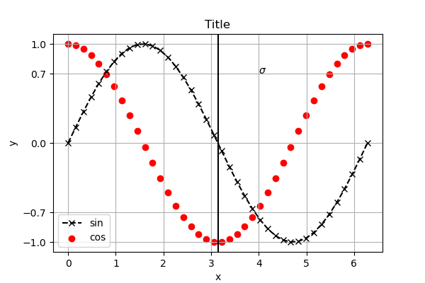
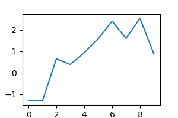
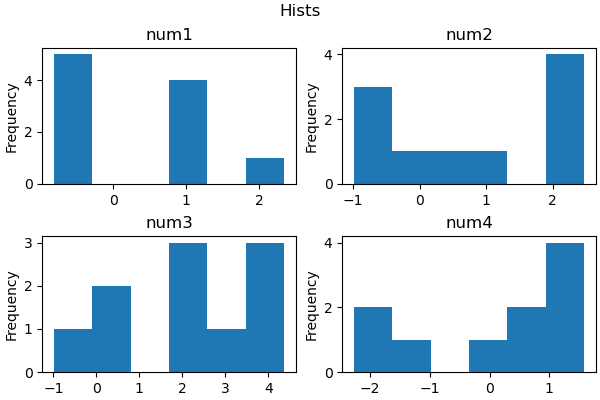
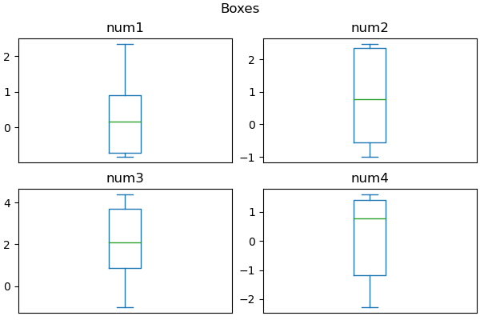
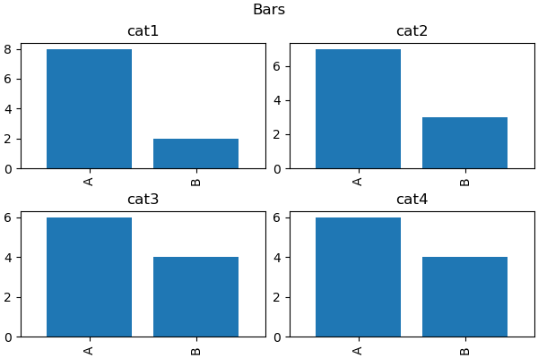
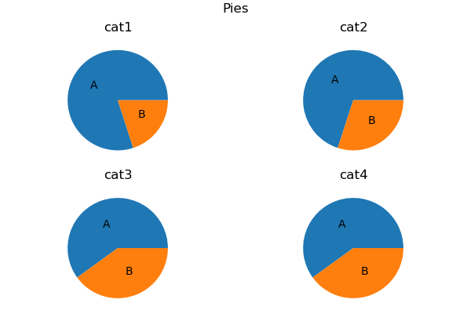

## [MatPlotLib](https://matplotlib.org/stable/index.html)

\- библиотека для построения [графиков](https://matplotlib.org/stable/plot_types/index.html).

```
pip install matplotlib
```

```python
import numpy as np
import matplotlib.pyplot as plt
%matplotlib inline  # для отображения графиков в jupyter notebook
```


### Один график



```python
x = np.linspace(0, 2*np.pi, 40)
y1 = np.sin(x)
y2 = np.cos(x)

# plt.figure(figsize=(6, 4))  # 480x320 px
fig, ax = plt.subplots(figsize=(6, 4), layout='constrained')  # явное создание фигур и осей (объектно-ориентированный стиль)

# plt.plot(x, y1, 'k--', marker='x', label='sin')  # график - линия
# plt.scatter(x, y2, c='r', label='cos')  # график - точками
# color='blue', linewidth=3, linestyle=':'
ax.plot(x, y1, 'k--', marker='x', label='sin')
ax.scatter(x, y2, c='r', label='cos')

# plt.title("Title")
# plt.xlabel('x')
# plt.ylabel('y')
# plt.legend()
# plt.text(4, 0.7, r'$\sigma$')
ax.set_title('Title')
ax.set_xlabel('x')
ax.set_ylabel('y')
ax.legend()
ax.text(4, 0.7, r'$\sigma$')

#plt.grid(True)
# plt.yticks([-1, -0.7, 0, 0.7, 1])  # назначить занчения к оси y
# plt.axvline(x=np.pi, color='k')  # вертикальная линия
ax.grid(True)
ax.set_yticks([-1, -0.7, 0, 0.7, 1])
ax.axvline(x=np.pi, color='k')

# plt.savefig('plt.png')  # сохранить график в файл
plt.show()
```


### Несколько графиков

```python
# fig = plt.figure()  # создадим три графика гризонтально
# ax1 = fig.add_subplot(1, 3, 1)
# ax1.plot(...)
# ax2 = fig.add_subplot(1, 3, 2)
# ax2.plot(...)
# ax3 = fig.add_subplot(1, 3, 3)
# ax3.plot(...)

fig, axs = plt.subplots(1, 3, figsize=(6, 4))
for ax in axs:
    ax.plot(...)
```


## Графики в pandas

```python
import random
import pandas as pd

data = pd.Series(np.random.randn(10).cumsum())
ax = data.plot(figsize=(3, 2))
```



```python
num_columns = ['num1', 'num2', 'num3', 'num4']
cat_columns = ['cat1', 'cat2', 'cat3', 'cat4']

df = pd.concat([
    pd.DataFrame(np.array([[random.choice(['A', 'B']) for _ in range(4)] for _ in range(10)]),
                 columns=cat_columns),
    pd.DataFrame(np.random.randn(10, 4).cumsum(0), columns=num_columns)
], axis=1)

from tabulate import tabulate
print(tabulate(df, headers='keys', tablefmt='psql'))
```

```
+----+--------+--------+--------+--------+-----------+-----------+-----------+------------+
|    | cat1   | cat2   | cat3   | cat4   |      num1 |      num2 |      num3 |       num4 |
|----+--------+--------+--------+--------+-----------+-----------+-----------+------------|
|  0 | A      | A      | A      | A      |  0.763504 | -0.64488  |  0.604748 |  1.3026    |
|  1 | B      | A      | A      | B      |  0.771157 | -0.988356 | -0.988687 |  1.44354   |
|  2 | A      | A      | B      | A      |  2.34317  |  0.65421  |  0.30757  |  1.58763   |
|  3 | A      | A      | B      | B      |  0.940791 | -0.306627 |  1.71728  |  1.56669   |
|  4 | B      | B      | A      | A      |  1.18176  | -0.635313 |  2.49895  | -0.0432896 |
|  5 | A      | B      | A      | B      | -0.816378 |  0.889933 |  1.71119  |  0.847853  |
|  6 | A      | A      | A      | A      | -0.801357 |  2.47587  |  2.83416  |  0.679505  |
|  7 | A      | A      | B      | A      | -0.592333 |  2.40678  |  3.98285  | -1.56266   |
|  8 | A      | B      | A      | B      | -0.738431 |  2.21976  |  4.37329  | -2.27403   |
|  9 | A      | A      | B      | A      | -0.424044 |  2.43049  |  4.06583  | -1.87429   |
+----+--------+--------+--------+--------+-----------+-----------+-----------+------------+
```


### [df.plot](https://pandas.pydata.org/pandas-docs/stable/reference/api/pandas.DataFrame.plot.html)



```python
fig, axs = plt.subplots(2, 2, figsize=(6, 4), layout='constrained')
for ax, col in zip(axs.flatten(), df[num_columns].columns):
    df[col].plot(kind='hist', bins=6, ax=ax, title=col)

fig.suptitle('Hists')
plt.show()
```

---



```python
# fig, ax = plt.subplots(figsize=(6, 4), layout='constrained') 
# ax.boxplot(df[num_columns])
# plt.show()

fig, axs = plt.subplots(2, 2, figsize=(6, 4), layout='constrained')
for ax, col in zip(axs.flatten(), df[num_columns].columns):
    df[col].plot(kind='box', ax=ax, title=col)
    ax.set_xticks([])

fig.suptitle('Boxes')
plt.show()
```

---



```python
fig, axs = plt.subplots(2, 2, figsize=(6, 4), layout='constrained')
for ax, col in zip(axs.flatten(), df[cat_columns].columns):
    x = df[col].value_counts()
    # ax.bar(height=x, x=x.index, width=0.8)
    # ax.set_title(col)
    x.plot(kind='bar', ax=ax, width=0.8, title=col)

fig.suptitle('Bars')
plt.show()
```

---



```python
# fig, ax = plt.subplots(figsize=(6, 4), layout='constrained') 
# ax.boxplot(df[num_columns])
# plt.show()

fig, axs = plt.subplots(2, 2, figsize=(6, 4), layout='constrained')
for ax, col in zip(axs.flatten(), df[cat_columns].columns):
    x = df[col].value_counts()
    # ax.pie(x=x, labels=x.index, labeldistance=0.5)
    # ax.set_title(col)
    x.plot(kind='pie', ax=ax, labels=x.index, labeldistance=0.5, ylabel='', title=col)

fig.suptitle('Pies')
plt.show()
```


## [SeaBorn](http://seaborn.pydata.org/tutorial/introduction.html)

\- библиотека для статистических графиков.

```python

```

```python

```

```python

```
